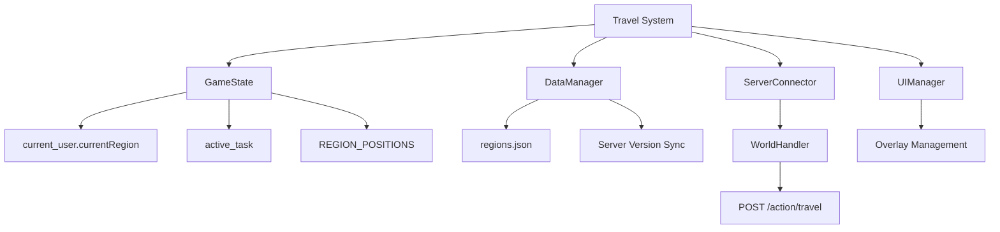
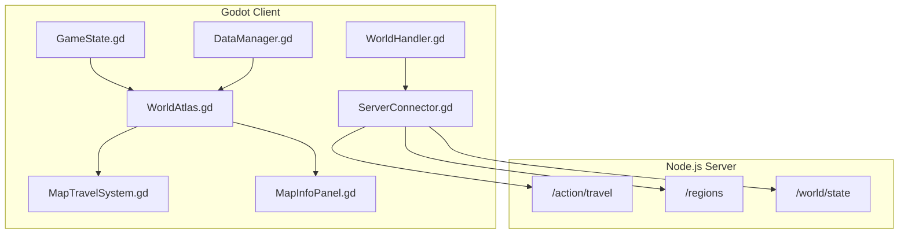
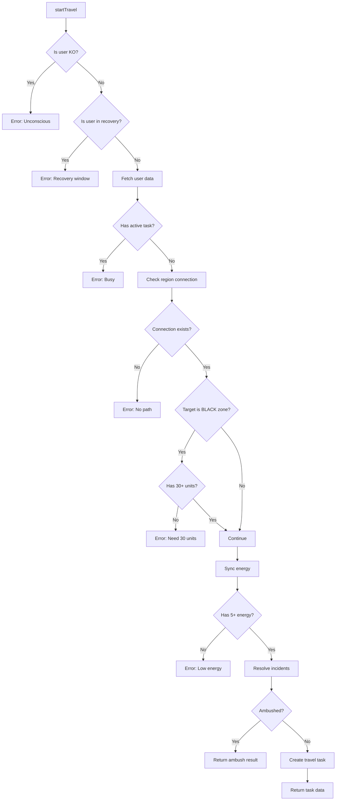
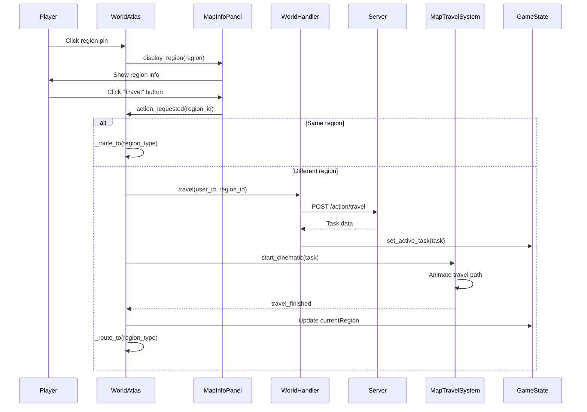
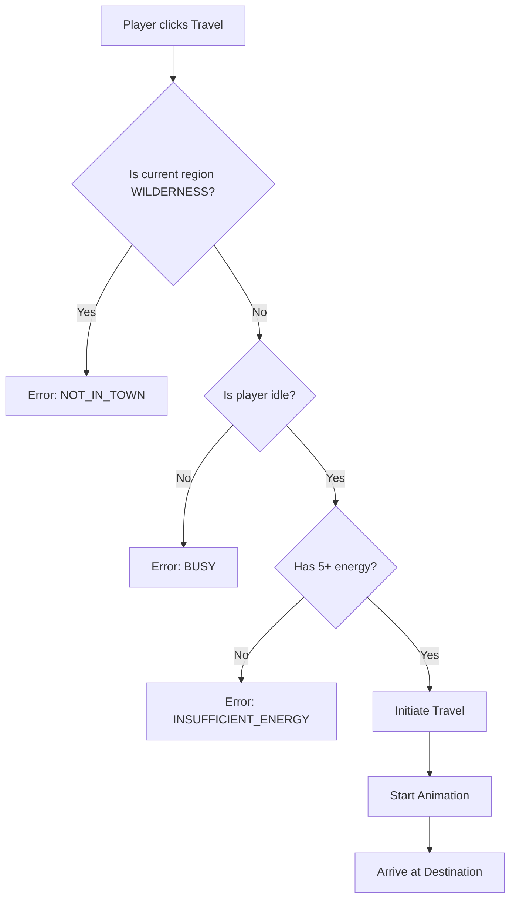
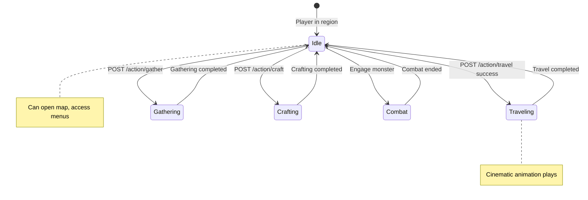

# Travel System Documentation

**Version:** 2.0.0  
**Last Updated:** 2026-02-14  
**Status:** Fully Implemented  
**Database:** SQLite (Prisma ORM)

This document provides comprehensive documentation for the Travel System in Textical, covering architecture, API endpoints, client implementation, database schema, and gameplay mechanics.

---

## Table of Contents

1. [Overview](#1-overview)
2. [Architecture](#2-architecture)
3. [Database Schema](#3-database-schema)
4. [API Reference](#4-api-reference)
5. [Server Implementation](#5-server-implementation)
6. [Client Implementation](#6-client-implementation)
7. [Region System](#7-region-system)
8. [World Map](#8-world-map)
9. [Travel Incidents](#9-travel-incidents)
10. [Gameplay Mechanics](#10-gameplay-mechanics)
11. [State Management](#11-state-management)
12. [Error Handling](#12-error-handling)
13. [Future Development](#13-future-development)

---

## 1. Overview

### 1.1 Purpose

The Travel System enables players to navigate between different regions in the game world. It provides:

- **Node-based map navigation** - Players select destination regions from a visual map
- **Cinematic travel animation** - Visual feedback during travel transitions
- **Resource management** - Travel costs energy points
- **Region-based gameplay** - Different regions offer different activities

### 1.2 Core Features

| Feature | Status | Description |
|---------|--------|-------------|
| Region Selection | ✅ Implemented | Click on map pins to select destination |
| Travel Animation | ✅ Implemented | Cinematic path animation with camera follow |
| Energy Cost | ✅ Implemented | 5 energy per travel |
| Travel Duration | ✅ Implemented | 15 seconds server-side |
| Region Types | ✅ Implemented | TOWN, WILDERNESS, DUNGEON |
| Visual Themes | ✅ Implemented | 25 different biome themes |

### 1.3 System Dependencies



---

## 2. Architecture

### 2.1 Component Overview



### 2.2 File Structure

```
client/
├── src/
│   ├── ui/
│   │   ├── WorldAtlas.gd          # Main map controller
│   │   ├── WorldAtlas.tscn        # Map scene structure
│   │   ├── MapTravelSystem.gd     # Travel animation logic
│   │   ├── MapCamera.gd           # Camera control
│   │   └── MapInfoPanel.gd        # Region info display
│   ├── network/
│   │   └── WorldHandler.gd        # Network API calls
│   └── autoload/
│       ├── game_state.gd          # Global state management
│       └── data_manager.gd        # Data caching & sync
└── assets/
    └── data/
        └── regions.json           # Region definitions
```

### 2.3 Class Responsibilities

| Class | Responsibility |
|-------|---------------|
| [`WorldAtlas.gd`](../client/src/ui/WorldAtlas.gd) | Main map overlay controller, handles user interactions |
| [`MapTravelSystem.gd`](../client/src/ui/MapTravelSystem.gd) | Cinematic travel animation and path rendering |
| [`WorldHandler.gd`](../client/src/network/WorldHandler.gd) | Network API calls for travel and world data |
| [`GameState.gd`](../client/src/autoload/game_state.gd) | Global state: current region, active task |
| [`DataManager.gd`](../client/src/autoload/data_manager.gd) | Region data caching and version sync |
| [`TravelService.js`](../server/src/services/travelService.js) | Server-side travel logic, validation, task creation |
| [`TravelIncidentResolver.js`](../server/src/logic/world/TravelIncidentResolver.js) | Bandit ambush and spirit encounter resolution |

---

## 3. Database Schema

### 3.1 RegionTemplate Model

The [`RegionTemplate`](../server/prisma/schema.prisma:487) model contains **60+ fields** defining region properties:

#### Core Fields

| Field | Type | Default | Description |
|-------|------|---------|-------------|
| `id` | Int | Auto | Primary key (region ID) |
| `name` | String | - | Display name |
| `description` | String | - | Lore description |
| `visualType` | String | "TOWN" | Visual theme (see REGION_TYPES.md) |
| `zoneType` | String | "GREEN" | Zone classification |
| `zoneLevel` | Int | 1 | Difficulty level |
| `isSafeZone` | Boolean | true | No hostile encounters |

#### Position & Navigation

| Field | Type | Default | Description |
|-------|------|---------|-------------|
| `gridX` | Int | 0 | World grid X coordinate |
| `gridY` | Int | 0 | World grid Y coordinate |
| `traversalType` | Enum | WALK | Movement type (WALK, SWIM, FLY) |
| `teleportCostMultiplier` | Float | 1.0 | Teleport cost modifier |

#### Combat & Danger

| Field | Type | Default | Description |
|-------|------|---------|-------------|
| `dangerLevel` | Int | 1 | Encounter difficulty |
| `banditThreatLevel` | Float | 0.0 | Bandit ambush probability |
| `spiritDensity` | Float | 0.0 | Spirit encounter rate |
| `corruptionLevel` | Float | 0.0 | World corruption intensity |
| `sanctuaryPower` | Float | 0.0 | Safe zone protection |
| `pvpMode` | Enum | SAFE | PvP rules (SAFE, OPTIONAL, MANDATORY) |

#### Resources & Economy

| Field | Type | Default | Description |
|-------|------|---------|-------------|
| `resourceModifier` | Float | 1.0 | Gathering yield multiplier |
| `resourceScarcity` | Float | 1.0 | Resource availability |
| `marketDemandIndex` | Float | 1.0 | Local market prices |
| `regionalTaxRate` | Float | 0.10 | Transaction tax rate |
| `innRecoveryRate` | Float | 1.0 | Energy recovery speed |

#### Environment

| Field | Type | Default | Description |
|-------|------|---------|-------------|
| `elementalAffinity` | String | "NEUTRAL" | Element type (FIRE, WATER, etc.) |
| `terrainAttackMod` | Float | 1.0 | Attack modifier in this terrain |
| `terrainDefenseMod` | Float | 1.0 | Defense modifier in this terrain |
| `weatherOverride` | String? | null | Fixed weather type |
| `fogDensity` | Float | 0.0 | Visual fog intensity |
| `particleEffectPack` | String? | null | Particle effects (EMBER_SPARKS, etc.) |
| `skyboxOverride` | String? | null | Skybox theme |

#### Requirements & Restrictions

| Field | Type | Default | Description |
|-------|------|---------|-------------|
| `requiredLevel` | Int | 1 | Minimum player level |
| `minRequiredUnits` | Int | 0 | Minimum party size (BLACK zones: 30) |
| `minRequiredHeroLevel` | Int | 1 | Minimum hero level |
| `reputationRequirement` | Int | 0 | Faction reputation needed |
| `respawnPenaltyMult` | Float | 1.0 | Death penalty multiplier |

### 3.2 RegionConnection Model

Defines travel routes between regions:

```prisma
model RegionConnection {
  originRegionId   Int
  targetRegionId   Int
  travelTimeSeconds Int    @default(15)
  origin           RegionTemplate @relation("OriginRegion")
  target           RegionTemplate @relation("TargetRegion")
}
```

| Field | Type | Description |
|-------|------|-------------|
| `originRegionId` | Int | Source region ID |
| `targetRegionId` | Int | Destination region ID |
| `travelTimeSeconds` | Int | Travel duration (default: 15s) |

### 3.3 TaskQueue Model

Tracks active travel tasks:

```prisma
model TaskQueue {
  id             Int      @id @default(autoincrement())
  userId         Int
  type           String   // "TRAVEL", "HAULING_STAY"
  status         String   // "RUNNING", "COMPLETED", "CANCELLED"
  originRegionId Int
  targetRegionId Int
  startedAt      DateTime
  finishesAt     DateTime
  user           User     @relation
  originRegion   RegionTemplate @relation("TaskTravelOrigin")
  targetRegion   RegionTemplate @relation("TaskTravelTarget")
}
```

### 3.4 User Model (Travel-Related Fields)

```prisma
model User {
  currentRegion      Int       @default(1)
  isKnockedOut       Boolean   @default(false)
  knockedOutUntil    DateTime?
  recoveryUntil      DateTime?
  escortGridsRemaining Int     @default(0)
  activeEscortName   String?
  banditReputation   Float     @default(0.0)
  activeSpiritId     Int?
  activeSpiritExpiresAt DateTime?
  // ... other fields
}
```

---

## 4. API Reference

### 4.1 Travel Endpoint

**Initiates travel to a target region.**

```
POST /api/action/travel
```

#### Request Body

```json
{
  "userId": 1,
  "targetRegionId": 2
}
```

| Parameter | Type | Required | Description |
|-----------|------|----------|-------------|
| `userId` | integer | Yes | The user's unique identifier |
| `targetRegionId` | integer | Yes | Destination region ID |

#### Success Response (200 OK)

```json
{
  "success": true,
  "message": "Success",
  "data": {
    "id": 1001,
    "type": "TRAVEL",
    "status": "RUNNING",
    "startedAt": 1739312400000,
    "finishesAt": 1739312415000,
    "originRegionId": 1,
    "targetRegionId": 2,
    "targetRegion": {
      "id": 2,
      "name": "Forest of Beginnings",
      "visualType": "forest"
    },
    "targetRegionType": "WILDERNESS",
    "ambientSign": "You notice signs of bandit activity in the area...",
    "spiritEncounter": null
  }
}
```

| Field | Type | Description |
|-------|------|-------------|
| `id` | integer | Task ID |
| `type` | string | Task type (`TRAVEL` or `HAULING_STAY`) |
| `status` | string | Task status (`RUNNING`) |
| `startedAt` | integer | Start time as UNIX timestamp (milliseconds) |
| `finishesAt` | integer | Completion time as UNIX timestamp (milliseconds) |
| `originRegionId` | integer | Source region ID |
| `targetRegionId` | integer | Destination region ID |
| `targetRegion` | object | Target region details |
| `targetRegionType` | string | Visual type of target region |
| `ambientSign` | string? | Atmospheric message based on bandit threat |
| `spiritEncounter` | object? | Spirit encounter data if triggered |

#### Ambush Response (200 OK)

When player is ambushed by bandits during travel:

```json
{
  "success": true,
  "message": "Success",
  "data": {
    "status": "AMBUSHED",
    "message": "Bandits have ambushed you on the road!",
    "ransomCost": 150,
    "regionId": 5
  }
}
```

| Field | Type | Description |
|-------|------|-------------|
| `status` | string | Always `AMBUSHED` |
| `message` | string | Ambush description |
| `ransomCost` | integer | Silver required to escape (30% of player's silver) |
| `regionId` | integer | Region where ambush occurred |

#### Error Responses

| Status | Error Message | Condition |
|--------|---------------|-----------|
| 400 | `"You are unconscious and cannot travel."` | Player is knocked out |
| 400 | `"You must wait for your recovery window to end..."` | Player in recovery |
| 400 | `"User not found"` | Invalid user ID |
| 400 | `"You cannot start a journey while busy..."` | Active task exists |
| 400 | `"No direct path exists from here."` | No RegionConnection found |
| 400 | `"Black Zone Danger: You need minimum 30 units..."` | Black zone without 30+ units |
| 400 | `"Not enough Energy."` | Energy < 5 |

### 4.2 Get All Regions

**Retrieves list of all available regions.**

```
GET /api/regions
```

#### Query Parameters

| Parameter | Type | Required | Description |
|-----------|------|----------|-------------|
| `type` | string | No | Filter by type: `TOWN`, `WILDERNESS`, `DUNGEON` |

#### Success Response (200 OK)

```json
{
  "success": true,
  "data": [
    {
      "id": 1,
      "name": "Oakhaven Hub",
      "type": "TOWN",
      "visualType": "town",
      "isSafe": true,
      "monsters": []
    },
    {
      "id": 2,
      "name": "Iron Mine",
      "type": "WILDERNESS",
      "visualType": "mine",
      "isSafe": false,
      "monsters": [
        { "templateId": 6001, "name": "Cave Spider", "level": 3 }
      ]
    }
  ]
}
```

### 4.3 Get Region Details

**Retrieves detailed information about a specific region.**

```
GET /api/region/:id
```

#### Path Parameters

| Parameter | Type | Required | Description |
|-----------|------|----------|-------------|
| `id` | integer | Yes | Region ID |

#### Success Response (200 OK)

```json
{
  "success": true,
  "data": {
    "id": 1,
    "name": "Oakhaven Hub",
    "type": "TOWN",
    "visualType": "town",
    "description": "A peaceful sanctuary untouched by the Dark Grove's corruption.",
    "lore": "Oakhaven was founded 200 years ago by the legendary logger, Silas Elm.",
    "npcs": [
      {
        "id": 101,
        "name": "Blacksmith",
        "role": "CRAFTER",
        "services": ["repair", "craft"]
      }
    ],
    "buildings": ["tavern", "market", "quest_board"],
    "terrainModifiers": {
      "defenseBonus": 0,
      "resourceBonus": 0
    }
  }
}
```

### 4.4 Get World State

**Retrieves current world state information.**

```
GET /api/world/state
```

#### Success Response (200 OK)

```json
{
  "success": true,
  "data": {
    "activePlayers": 42,
    "serverStatus": "online",
    "eventActive": "none",
    "timestamp": "2026-02-12T01:00:00Z"
  }
}
```

---

## 5. Server Implementation

### 5.1 TravelService.js

The [`TravelService`](../server/src/services/travelService.js) class handles all server-side travel logic:

#### Constants

```javascript
BASE_TRAVEL_ENERGY_COST = 5
```

#### Main Method: `startTravel()`

```javascript
async startTravel(userIdRaw, targetRegionIdRaw, mode = "NORMAL")
```

**Flow:**



#### Validation Checks

| Check | Error Message | Condition |
|-------|---------------|-----------|
| KO Status | "You are unconscious and cannot travel." | `isKnockedOut = true` |
| Recovery | "You must wait for your recovery window..." | `recoveryUntil > now` |
| Busy | "You cannot start a journey while busy..." | Active task exists |
| No Path | "No direct path exists from here." | No RegionConnection found |
| Black Zone | "Black Zone Danger: You need minimum 30 units..." | `zoneType = BLACK` and units < 30 |
| Energy | "Not enough Energy." | `energy < 5` |

#### Task Creation

```javascript
async _executeTravelTask(userId, originId, targetId, type, duration, escortUpdate) {
    const now = new Date();
    const finishesAt = new Date(now.getTime() + (duration * 1000));

    return await prisma.$transaction([
        // 1. Update user
        prisma.user.update({
            where: { id: userId },
            data: {
                energy: { decrement: this.BASE_TRAVEL_ENERGY_COST },
                isInTavern: false,
                tavernEntryAt: null,
                ...(type === "HAULING_STAY" ? { currentRegion: targetId } : {}),
                ...escortUpdate
            }
        }),
        // 2. Create task
        prisma.taskQueue.create({
            data: {
                userId, type,
                originRegionId: originId,
                targetRegionId: targetId,
                status: "RUNNING",
                startedAt: now,
                finishesAt: finishesAt
            },
            include: { targetRegion: true }
        })
    ]);
}
```

### 5.2 Travel Modes

| Mode | Task Type | Duration | Description |
|------|-----------|----------|-------------|
| `NORMAL` | `TRAVEL` | 15s (configurable) | Standard travel |
| `HAULING` | `HAULING_STAY` | 60s | Hauling with wagon |

---

## 6. Client Implementation

### 6.1 WorldAtlas.gd

The main map controller that handles user interactions and orchestrates travel.

#### Key Signals

```gdscript
# Inherited from AtlasBase
signal region_selected(region_id)
signal travel_initiated(region_id)
```

#### Key Methods

```gdscript
# Setup when opened as overlay
func setup_as_overlay(_data: Dictionary = {}) -> void

# Handle travel button click
func _on_action_requested(region_id: int) -> void

# Handle travel animation completion
func _on_travel_finished(target_id: int, target_type: String) -> void

# Route to appropriate scene based on region type
func _route_to(region_type: String) -> void
```

#### Travel Flow



### 6.2 MapTravelSystem.gd

Handles the cinematic travel animation between regions.

#### Properties

```gdscript
var is_traveling: bool = false
var _target_id: int = -1
var _target_type: String = "TOWN"
var _progress: float = 0.0
var _duration: float = 5.0  # Animation duration in seconds
```

#### Key Methods

```gdscript
# Start the cinematic travel animation
func start_cinematic(task: Dictionary) -> void:
    var target_rid = int(str(task.get("targetRegionId", 1)).to_float())
    var origin_rid = int(str(task.get("originRegionId", 1)).to_float())
    
    _target_id = target_rid
    _target_type = DataManager.get_region(target_rid).get("type", "TOWN")
    
    var start_pos = GameState.REGION_POSITIONS.get(origin_rid, Vector2(2500, 2500))
    var end_pos = GameState.REGION_POSITIONS.get(target_rid, Vector2(2500, 2500))
    
    # Create path curve
    path_2d.curve = Curve2D.new()
    path_2d.curve.add_point(start_pos)
    path_2d.curve.add_point(end_pos)
    
    # Start animation
    _progress = 0.0
    is_traveling = true
```

#### Animation Loop

```gdscript
func _process(delta):
    if !is_traveling: return
    
    _progress += delta / _duration
    var p = clamp(_progress, 0.0, 1.0)
    
    # Update path follow position
    follow_2d.progress_ratio = p
    
    # Camera follows the travel position
    if camera:
        camera.center_on(follow_2d.position)
    
    # Animation complete
    if p >= 1.0:
        is_traveling = false
        travel_finished.emit(_target_id, _target_type)
```

### 6.3 WorldHandler.gd

Network handler for travel and world-related API calls.

```gdscript
extends BaseNetworkHandler
class_name WorldHandler

# Fetch all regions
func fetch_all_regions() -> void:
    _request("/regions", HTTPClient.METHOD_GET)

# Get single region details
func get_region_details(id: int) -> void:
    _request("/region/" + str(id), HTTPClient.METHOD_GET)

# Initiate travel
func travel(u_id: int, r_id: int) -> void:
    _request("/action/travel", HTTPClient.METHOD_POST, {
        "userId": u_id,
        "targetRegionId": r_id
    })

# Fetch world state
func fetch_world_state() -> void:
    _request("/world/state", HTTPClient.METHOD_GET)
```

---

## 7. Region System

### 5.1 Region Types

| Type | ID Prefix | Description | Features |
|------|-----------|-------------|----------|
| `TOWN` | 1xx | Safe hub areas | NPCs, Crafting, Tavern, Market |
| `WILDERNESS` | 2xx | Open world zones | Monsters, Gathering, Combat |
| `DUNGEON` | 3xx | Instanced content | Bosses, Rare Loot |

### 5.2 Current Regions

Defined in [`client/assets/data/regions.json`](../client/assets/data/regions.json):

| ID | Name | Type | Visual Theme | Lore |
|----|------|------|--------------|------|
| 1 | Oakhaven Hub | TOWN | town | Founded 200 years ago by Silas Elm |
| 2 | Iron Mine | WILDERNESS | mine | Titan's Blood iron veins, Cave Spiders |
| 3 | Crystal Depths | WILDERNESS | dungeon | Birthplace of first Wizards, Mana Crystals |
| 4 | Elm Forest | WILDERNESS | forest | Ancient hunting grounds, Elm wood |
| 5 | Forbidden Grove | WILDERNESS | ruins | Corruption epicentre, drains energy |

### 5.3 Visual Themes

The game supports **25 different visual themes** defined in [`REGION_TYPES.md`](REGION_TYPES.md):

| Theme | Scene File | Particle Effects |
|-------|------------|------------------|
| TOWN | TownScreen.tscn | Golden hour ambiance |
| FOREST | ForestScreen.tscn | Fireflies |
| MINE | MineScreen.tscn | Floating dust, ore glow |
| DUNGEON | DungeonScreen.tscn | Magic mist |
| RUINS | RuinsScreen.tscn | Floating ash |
| VOLCANO | VolcanoScreen.tscn | Fire embers |
| DESERT | DesertScreen.tscn | Drifting sand |
| SNOW | SnowScreen.tscn | Falling snowflakes |
| SWAMP | SwampScreen.tscn | Toxic fog |
| GRAVEYARD | GraveyardScreen.tscn | Ghostly wisps |
| OCEAN | OceanScreen.tscn | Bubbles |
| STORM | StormScreen.tscn | Rain |
| AUTUMN | AutumnScreen.tscn | Maple leaves |
| CORAL | CoralScreen.tscn | Vibrant bubbles |
| ICE | GlacierScreen.tscn | Frost dust |
| LAVA | LavaScreen.tscn | Fire particles |
| FAIRY | FairyScreen.tscn | Floating glitter |
| ARENA | ArenaScreen.tscn | Battle dust |
| CASTLE | CastleScreen.tscn | Wind streaks |
| SHIP | ShipScreen.tscn | Spectral fog |
| PRISON | PrisonScreen.tscn | Cold iron atmosphere |
| GIANT | GiantScreen.tscn | Bone dust |
| HELL | HellScreen.tscn | Blood rain |
| GARDEN | GardenScreen.tscn | Flower petals |
| WASTELAND | WastelandScreen.tscn | Static noise |

### 5.4 Region Data Structure

```json
{
  "1": {
    "name": "Oakhaven Hub",
    "type": "TOWN",
    "lore": "Oakhaven was founded 200 years ago...",
    "history": "A peaceful sanctuary untouched...",
    "tips": [
      "Tavern recovery is 10x faster than outside.",
      "Check the Quest Board daily for gold."
    ]
  }
}
```

---

## 8. World Map

### 6.1 Geographic Layout

The world is a **5000x5000 unit grid** with regions positioned at specific coordinates:

```gdscript
# From GameState.gd
const REGION_POSITIONS = {
    1: Vector2(2500, 2500),  # Oakhaven Hub (CENTER)
    2: Vector2(1200, 1800),  # Iron Mine (West)
    3: Vector2(800, 800),    # Crystal Depths (North West)
    4: Vector2(3800, 1800),  # Elm Forest (East)
    5: Vector2(4200, 800)    # Forbidden Grove (North East)
}
```

### 6.2 World Map Visualization

```
┌─────────────────────────────────────────────────────┐
│                                                     │
│    [3] Crystal Depths        [5] Forbidden Grove   │
│        (800, 800)               (4200, 800)        │
│                                                     │
│         [2] Iron Mine                              │
│           (1200, 1800)                             │
│                                                     │
│                    [1] Oakhaven Hub                │
│                     (2500, 2500)                   │
│                       ★ CENTER                     │
│                                                     │
│                          [4] Elm Forest            │
│                            (3800, 1800)            │
│                                                     │
└─────────────────────────────────────────────────────┘
```

### 6.3 Flavor Landmarks

Decorative locations that add world-building flavor:

```gdscript
const FLAVOR_LANDMARKS = [
    {"name": "Lake of Whispers", "pos": Vector2(2500, 1500)},
    {"name": "The Shattered Peaks", "pos": Vector2(500, 500)},
    {"name": "Ancient Sentinel Pillar", "pos": Vector2(4500, 4500)},
    {"name": "Siren's Whisp Falls", "pos": Vector2(1500, 1000)},
    {"name": "The Weeping Sands", "pos": Vector2(3500, 3500)},
    {"name": "Dead Man's Pass", "pos": Vector2(2500, 3200)},
    {"name": "Sun-King Observatory", "pos": Vector2(1000, 4000)}
]
```

---

## 10. Gameplay Mechanics

### 7.1 Travel Rules

| Rule | Value | Notes |
|------|-------|-------|
| **Energy Cost** | 5 points | Deducted on travel initiation |
| **Duration** | 15 seconds | Server-side timer |
| **Animation** | 5 seconds | Client-side cinematic |
| **Cooldown** | None | Can travel immediately after arrival |
| **Restriction** | Cannot travel from WILDERNESS | Must return to town first |

### 7.2 Travel Prerequisites



### 7.3 Region Activities

#### TOWN Regions
- **Tavern**: Rest and recover energy (10x faster)
- **Market**: Buy/sell items
- **Crafting**: Create equipment
- **Quest Board**: Accept new quests
- **Formation**: Manage hero party

#### WILDERNESS Regions
- **Combat**: Fight monsters
- **Gathering**: Collect resources (costs 3 energy)
- **Exploration**: Discover secrets
- **Quest Objectives**: Kill/collection targets

### 7.4 Region-Specific Bonuses

Certain heroes receive bonuses in specific region types:

| Hero Type | Bonus Region | Bonus Type |
|-----------|--------------|------------|
| Dwarf/Miner | Mine | +50% gathering speed |
| Light-trait | Crystal Depths | +20% damage |
| Fire-trait | Elm Forest | +30% damage (risky) |
| Archer/Rogue | Any | Scouting power (future) |

---

## 9. Travel Incidents

Travel incidents are random encounters that can occur during travel between regions. These add risk and strategic depth to the travel system.

### 9.1 Bandit Ambush

Bandit ambushes are hostile encounters triggered based on the destination region's threat level.

**Trigger Conditions:**
- Random roll against `banditThreatLevel` of destination region
- No escort protection active
- Player has silver in inventory

**Ambush Probability by Zone Type:**

| Zone Type | Base Ambush Chance |
|-----------|-------------------|
| WATER | 5% |
| GREEN | 10% |
| BLUE | 20% |
| YELLOW | 35% |
| RED | 50% |
| BLACK | 80% |
| BOSS | 60% |
| CITADEL | 0% |
| VILLAGE | 5% |
| BRIDGE | 25% |
| CHASM | 40% |

**Resolution Options:**
1. **Pay Ransom**: 30% of player's silver (`ransomCost = Math.floor(userData.silver * 0.3)`)
2. **Fight**: Combat encounter with bandit group
3. **Flee**: Success based on hero speed stats

**Implementation:** [`server/src/logic/world/TravelIncidentResolver.js`](../server/src/logic/world/TravelIncidentResolver.js)

### 9.2 Spirit Encounter

Spirit encounters are mystical events that can provide boons or challenges.

**Trigger Conditions:**
- Based on `spiritDensity` of destination region
- Higher chance during certain world events
- Affected by player's spirit affinity

**Spirit Types:**
- **Benevolent Spirit**: Grants temporary buff or item
- **Neutral Spirit**: Offers trade or information
- **Malevolent Spirit**: Triggers combat or debuff

### 9.3 Escort Protection

Players with active escorts are immune to bandit ambushes.

```javascript
// Check for escort protection
if (userData.hasEscort && userData.escortType === 'MERCENARY') {
    // Skip ambush check
    return { incident: null, protected: true };
}
```

---

## 11. State Management

### 11.1 GameState Properties

```gdscript
# Current user data
var current_user = {
    "id": 1,
    "currentRegion": 1,  # Updated on travel completion
    "energy": 100,
    "gold": 1500
}

# Active travel task
var active_task = {
    "taskId": 1001,
    "type": "TRAVEL",
    "status": "RUNNING",
    "originRegionId": 1,
    "targetRegionId": 2,
    "targetRegionType": "WILDERNESS"
}

# Current region data (updated on arrival)
var current_region_data = {
    "id": 2,
    "name": "Iron Mine",
    "type": "WILDERNESS"
}
```

### 11.2 State Transitions



### 11.3 Signal Flow

```gdscript
# GameState signals
signal region_changed(new_data)      # Emitted when current_region_data changes
signal task_updated(task)            # Emitted when active_task changes

# WorldAtlas signal connections
func _ready():
    travel_system.travel_finished.connect(_on_travel_finished)
    ServerConnector.task_completed.connect(_on_task_completed)
    ServerConnector.request_completed.connect(_on_request_completed)
```

---

## 12. Error Handling

### 12.1 Client-Side Validation

```gdscript
# In WorldAtlas.gd
func _on_action_requested(rid):
    # Check if clicking current region
    if rid == int(str(GameState.current_user.currentRegion).to_float()):
        _route_to(DataManager.get_region(rid).get("type", "TOWN"))
        return
    
    # Disable button during request
    ui_panel.start_btn.disabled = true
    
    # Send travel request
    ServerConnector.travel(GameState.current_user.id, rid)
```

### 12.2 Server Error Handling

```gdscript
# In WorldAtlas.gd
func _on_request_completed(endpoint, data):
    if endpoint.contains("/action/travel"):
        var travel_data = data
        
        # Unwrap response
        if data is Dictionary and data.has("data"):
            if data.get("success", true) == false:
                # Handle server error
                push_error("Travel Request Failed: " + str(data.get("message")))
                ui_panel.start_btn.disabled = false
                return
            travel_data = data.get("data")
        
        # Start cinematic
        player_marker.hide()
        travel_system.start_cinematic(travel_data)
```

### 12.3 Error Codes Reference

| Error Code | HTTP Status | Client Action |
|------------|-------------|---------------|
| `INVALID_REGION` | 400 | Show "Invalid destination" |
| `NOT_IN_TOWN` | 400 | Show "Return to town first" |
| `BUSY` | 400 | Show "Complete current task first" |
| `INSUFFICIENT_ENERGY` | 400 | Show "Need 5 energy to travel" |
| `UNAUTHORIZED` | 401 | Redirect to login |

---

## 13. Future Development

### 13.1 Planned Features

From [`docs/konsep/WORLD_EXPLORATION.md`](konsep/WORLD_EXPLORATION.md):

| Feature | Status | Description |
|---------|--------|-------------|
| World Map View | 🔄 In Progress | Interface improvements for region navigation |
| Scouting Power | 📋 Planned | Archer/Rogue heroes reveal more enemy info |
| Random World Events | 📋 Planned | Treasure chests, traveling merchants |
| Global World Boss | 📋 Planned | Server-wide boss encounters |
| Chain Quests | 📋 Planned | Story quests spanning multiple regions |

### 13.2 Expansion Hooks

The travel system is designed to support:

1. **New Region Types**
   - Add to `REGION_TYPES.md` registry
   - Create corresponding scene file
   - Update `get_region_scene()` in GameState

2. **Travel Modifiers**
   - Mount system (reduce travel time)
   - Portal network (instant travel between towns)
   - Weather effects (travel speed penalties)

3. **Region Events**
   - Dynamic monster spawns
   - Seasonal visual changes
   - Faction territory control

### 13.3 API Versioning

Current API version: **v2.0**

Future endpoints may include:
- `POST /action/travel/instant` - Premium instant travel
- `GET /regions/:id/events` - Region-specific events
- `POST /regions/:id/scout` - Scouting mechanic

---

## Appendix A: Database Statistics

### A.1 World Scale

| Metric | Value |
|--------|-------|
| Total Planned Regions | 1,225 |
| Grid Size | 35x35 |
| Starting Town ID | 1 (Citadel) |
| Database | SQLite via Prisma ORM |

### A.2 Zone Distribution

| Zone Type | Count | Percentage |
|-----------|-------|------------|
| WATER | ~122 | 10% |
| GREEN | ~245 | 20% |
| BLUE | ~245 | 20% |
| YELLOW | ~184 | 15% |
| RED | ~122 | 10% |
| BLACK | ~61 | 5% |
| BOSS | ~11 | 1% |
| CITADEL | ~11 | 1% |
| VILLAGE | ~61 | 5% |
| BRIDGE | ~98 | 8% |
| CHASM | ~61 | 5% |

### A.3 Zone Properties Reference

| Zone Type | Difficulty | Bandit Threat | Spirit Density |
|-----------|------------|---------------|----------------|
| WATER | 1 | 5% | Low |
| GREEN | 1-2 | 10% | Low |
| BLUE | 2-3 | 20% | Medium |
| YELLOW | 3-4 | 35% | Medium |
| RED | 4-5 | 50% | High |
| BLACK | 5-6 | 80% | Very High |
| BOSS | 6+ | 60% | High |
| CITADEL | 0 | 0% | None |
| VILLAGE | 1 | 5% | Low |
| BRIDGE | 2-4 | 25% | Medium |
| CHASM | 3-5 | 40% | High |

---

## Appendix B: Code Examples

### B.1 Initiating Travel from Code

```gdscript
# From any script with access to ServerConnector
func travel_to_region(region_id: int) -> void:
    if GameState.active_task != null:
        push_warning("Player is busy")
        return
    
    if GameState.current_user.energy < 5:
        push_warning("Not enough energy")
        return
    
    ServerConnector.travel(GameState.current_user.id, region_id)
```

### B.2 Checking Region Type

```gdscript
# Get region data
var region = DataManager.get_region(region_id)
var region_type = region.get("type", "TOWN")

# Check if safe zone
var is_safe = region_type == "TOWN"

# Get appropriate scene path
var scene_path = GameState.get_region_scene(region_type)
```

### B.3 Listening for Travel Completion

```gdscript
func _ready():
    GameState.region_changed.connect(_on_region_changed)

func _on_region_changed(new_data: Dictionary):
    print("Arrived at: ", new_data.get("name", "Unknown"))
    # Update UI, trigger events, etc.
```

---

## Appendix C: Troubleshooting

### C.1 Common Issues

| Issue | Cause | Solution |
|-------|-------|----------|
| Travel button disabled | Active task running | Wait for task completion |
| "NOT_IN_TOWN" error | In WILDERNESS | Return to town via menu |
| Animation stuck | Network timeout | Check server connection |
| Wrong scene loaded | Region type mismatch | Check `get_region_scene()` |

### C.2 Debug Commands

```gdscript
# Check current region
print("Current Region: ", GameState.current_user.currentRegion)

# Check active task
print("Active Task: ", GameState.active_task)

# Check region data
print("Region Data: ", DataManager.get_region(1))
```

---

## Changelog

| Version | Date | Changes |
|---------|------|---------|
| 2.1.0 | 2026-02-15 | Changed `startedAt` and `finishesAt` to UNIX timestamps (milliseconds); Updated API response documentation to match actual implementation; Added AMBUSHED response documentation |
| 2.0.0 | 2026-02-14 | Added database schema (Section 3), server implementation (Section 5), travel incidents (Section 9), database statistics (Appendix A); restructured section numbering |
| 1.0.0 | 2026-02-14 | Initial documentation |

---

## Related Documentation

- [`API.md`](API.md) - Complete API reference
- [`REGION_TYPES.md`](REGION_TYPES.md) - Visual theme registry
- [`COMBAT_SYSTEM.md`](COMBAT_SYSTEM.md) - Combat mechanics
- [`STAT_SYSTEM.md`](STAT_SYSTEM.md) - Hero statistics
