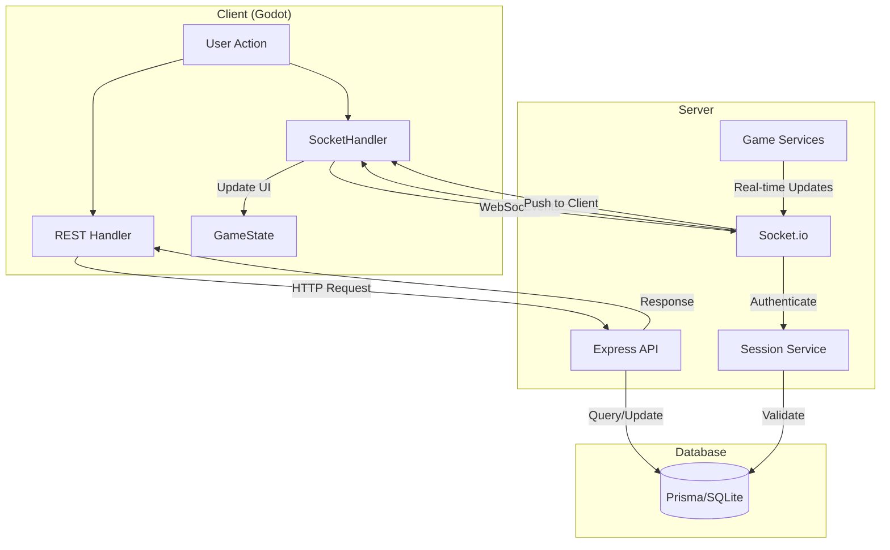

# Communication Architecture

## Overview

Dokumen ini menjelaskan arsitektur komunikasi 2 arah antara server dan client dalam proyek Textical. Textical menggunakan arsitektur **server-authoritative** dimana server menjaga integritas state dan client berfungsi sebagai visualizer untuk menampilkan data kepada pemain.

---

## Table of Contents

1. [Arsitektur Umum](#arsitektur-umum)
2. [REST API (HTTP)](#rest-api-http)
3. [WebSocket (Socket.io)](#websocket-socketio)
4. [Event Types](#event-types)
5. [Authentication Flow](#authentication-flow)
6. [Server Push Mechanisms](#server-push-mechanisms)
7. [Security](#security)
8. [Diagram](#diagram)

---

## Arsitektur Umum

Textical menggunakan dua mekanisme komunikasi yang saling melengkapi:

| Mekanisme | Teknologi | Penggunaan |
|-----------|-----------|------------|
| **REST API** | Express.js + HTTP | Login, inventory, heroes, crafting, market |
| **WebSocket** | Socket.io | Real-time updates, chat, guild events, task progress |

### Port Configuration

```
Server Port: 5000
API Endpoint: http://127.0.0.1:5000/api
WebSocket: ws://127.0.0.1:5000/socket.io/?EIO=4&transport=websocket
```

---

## REST API (HTTP)

### Client Implementation

**Base URL:** [`server_connector.gd:31`](client/src/autoload/server_connector.gd:31)

```gdscript
var base_url = "http://127.0.0.1:5000/api"
```

**Handler Classes:**
- `AuthHandler` - Authentication
- `InventoryHandler` - Inventory management
- `BattleHandler` - Battle operations
- `MarketHandler` - Marketplace
- `QuestHandler` - Quest system
- `StatHandler` - Stats system
- `WorldHandler` - World/region data

Semua handler extends [`BaseNetworkHandler`](client/src/network/BaseNetworkHandler.gd:1) untuk request HTTP.

### Server Implementation

**Entry Point:** [`server.js:73`](server/src/server.js:73)

```javascript
app.use('/api', apiRoutes);
app.use('/api/debug', debugRoutes);
app.use('/api/admin', adminRoutes);
app.use('/assets', assetsRoutes);
```

### Supported Endpoints

| Endpoint | Method | Description |
|----------|--------|-------------|
| `/api/auth/login` | POST | User login |
| `/api/auth/register` | POST | User registration |
| `/api/inventory/:userId` | GET | Fetch user inventory |
| `/api/heroes/:userId` | GET | Fetch user heroes |
| `/api/market/listings` | GET | Fetch market listings |
| `/api/regions` | GET | Fetch all regions |
| `/api/quests/:userId` | GET | Fetch user quests |

---

## WebSocket (Socket.io)

### Client Implementation

**File:** [`SocketHandler.gd`](client/src/network/SocketHandler.gd)

```gdscript
var socket: WebSocketPeer = WebSocketPeer.new()

func connect_to_server():
    var ws_url = ServerConnector.base_url.replace("http://", "ws://").replace("https://", "wss://").replace("/api", "")
    ws_url += "/socket.io/?EIO=4&transport=websocket"
    socket.connect_to_url(ws_url)
```

### Server Implementation

**File:** [`socketService.js`](server/src/services/socketService.js)

```javascript
init(server) {
    this.io = new Server(server, {
        cors: { origin: "*" }
    });

    this.io.on("connection", (socket) => {
        // Handle connection
    });
}
```

### Key Features

| Feature | Implementation |
|---------|----------------|
| **Authentication** | Validasi session token |
| **Heartbeat** | Kirim setiap 25 detik |
| **User Mapping** | `userId → socketId` Map |
| **Multi-device** | Disconnect device lama saat login baru |

---

## Event Types

### Task Events

Real-time task progress updates.

```gdscript
# Client receives:
signal task_started(data)      # Task mulai
signal task_completed(data)   # Task selesai
signal task_failed(data)      # Task gagal
```

### Guild Events

```gdscript
signal guild_created(guild_data)
signal guild_left()
signal guild_disbanded()
signal guild_info_received(guild_data)
signal member_kicked(user_id)
signal member_promoted(user_id, new_role)
signal treasury_updated(gold, silver)
signal facility_built(facility_data)
signal facility_upgraded(facility_id, new_level)
```

### Chat Events

```gdscript
signal chat_message(data)
signal chat_typing(data)
signal chat_error(data)
```

### Stat Events

Live stat updates for heroes.

```gdscript
signal stat_updated(unit_id, stats_data)
signal stat_changed(unit_id, stat_name, old_value, new_value)
signal stat_cap_reached(unit_id, stat_name, current_value, cap_value)
signal elemental_affinity_updated(unit_id, affinities)
signal set_bonus_updated(unit_id, bonuses)
```

### Session Events

```gdscript
signal session_disconnecting(reason, message)
signal force_logout(reason)
signal session_expired(reason)
```

---

## Authentication Flow

```
┌──────────┐     POST /api/auth/login      ┌──────────┐
│  Client  │ ───────────────────────────► │  Server  │
│ (Godot)  │                              │ (Express)│
└──────────┘     { user, sessionToken }   └──────────┘
       │                                      │
       │     Connect WebSocket                │
       ▼                                      ▼
┌──────────┐                              ┌──────────┐
│  Client  │ ────── ws://.../socket ──► │  Server  │
│          │                              │ (Socket.io)
└──────────┘                              └──────────┘
       │                                      │
       │     42["authenticate", {userId,      │
       │      sessionToken}]                  │
       ▼                                      ▼
┌──────────┐                              ┌──────────┐
│  Client  │ ◄─── Validasi token ──────  │  Server  │
│          │     Simpan userId→socketId   │          │
└──────────┘                              └──────────┘
       │                                      │
       │     42["authenticated", {userId}]    │
       ▼                                      ▼
┌──────────┐                              ┌──────────┐
│  Client  │  Start heartbeat timer     │  Server  │
│          │ ◄─── (every 25 seconds) ──  │          │
└──────────┘                              └──────────┘
```

### Detail Steps

1. **HTTP Login:** Client mengirim POST ke `/api/auth/login` dengan username/password
2. **Session Creation:** Server membuat session, return `sessionToken`
3. **WebSocket Connect:** Client connect ke WebSocket endpoint
4. **Engine.io Handshake:** Socket.io protocol handshake (`0`, `40`)
5. **Authentication:** Client mengirim `authenticate` event dengan `userId` dan `sessionToken`
6. **Token Validation:** Server validasi session token via `sessionService.validateSession()`
7. **User Mapping:** Server simpan `userId → socketId` di Map
8. **Auth Confirmation:** Server emit `authenticated` event
9. **Heartbeat Start:** Client start timer untuk heartbeat setiap 25 detik

---

## Server Push Mechanisms

### Emit to Specific User

```javascript
// server/src/services/socketService.js:248
emitToUser(userId, event, data) {
    const socketId = this.userSockets.get(userId);
    if (socketId && this.io) {
        this.io.to(socketId).emit(event, data);
        return true;
    }
    return false;
}
```

### Broadcast to All

```javascript
// server/src/services/socketService.js:260
broadcast(event, data) {
    if (this.io) this.io.emit(event, data);
}
```

### Client Sending Events

```gdscript
# client/src/network/SocketHandler.gd

func guild_create(template_id: int, guild_name: String, description: String):
    var msg = '42["guild:create", %s]' % JSON.stringify({
        "templateId": template_id,
        "name": guild_name,
        "description": description
    })
    socket.send_text(msg)

func chat_send(data: Dictionary):
    var msg = '42["chat:send", %s]' % JSON.stringify(data)
    socket.send_text(msg)

func send_stat_allocation_request(unit_id: int, allocations: Dictionary):
    var msg = '42["stat:allocation_request", %s]' % JSON.stringify({
        "unitId": unit_id,
        "allocations": allocations
    })
    socket.send_text(msg)
```

### Socket.io Protocol Format

Textical menggunakan Socket.io dengan format:

- **Emit dari client:** `42["event_name", {data}]`
- **Angka 42** adalah namespace indicator untuk Socket.io

---

## Security

### Session Token Validation

Setiap socket authentication memvalidasi session token:

```javascript
// server/src/services/socketService.js:35
if (sessionToken) {
    const session = await sessionService.validateSession(sessionToken);
    if (!session) {
        socket.emit("session_invalid", { reason: "expired" });
        return;
    }
}
```

### Multi-Device Handling

Login baru memutuskan koneksi device lama:

```javascript
// server/src/services/socketService.js:44
const existingSocketId = this.userSockets.get(userId);
if (existingSocketId && existingSocketId !== socket.id) {
    // Kirim notifikasi ke device lama
    this.emitToSocket(existingSocketId, "session_disconnecting", {
        reason: "new_login",
        message: "New login detected on another device"
    });
    
    // Disconnect setelah 5 detik
    setTimeout(() => {
        this.disconnectSocket(existingSocketId, "new_login");
    }, 5000);
}
```

### Heartbeat

Client mengirim heartbeat setiap 25 detik untuk menjaga koneksi:

```gdscript
# client/src/network/SocketHandler.gd:63
func _setup_heartbeat_timer():
    _heartbeat_timer = Timer.new()
    _heartbeat_timer.wait_time = 25.0
    _heartbeat_timer.timeout.connect(_send_heartbeat)
    add_child(_heartbeat_timer)

func _send_heartbeat():
    var msg = '42["heartbeat", {"token": "%s"}]' % GameState.session_token
    socket.send_text(msg)
```

### Production Bypass Block

Admin bypass hanya tersedia di development mode:

```javascript
// server/src/services/socketService.js:106
if (process.env.NODE_ENV === 'development') {
    socket.on("admin_bypass_login", ...);
} else {
    socket.on("admin_bypass_login", () => {
        console.warn("[SECURITY] Admin bypass login attempt blocked in production");
    });
}
```

---

## Diagram

### Full Communication Architecture



---

## File References

### Client Side

| File | Description |
|------|-------------|
| [`client/src/autoload/server_connector.gd`](client/src/autoload/server_connector.gd) | Main API connector |
| [`client/src/network/SocketHandler.gd`](client/src/network/SocketHandler.gd) | WebSocket handler |
| [`client/src/network/BaseNetworkHandler.gd`](client/src/network/BaseNetworkHandler.gd) | Base HTTP handler |
| [`client/src/network/AuthHandler.gd`](client/src/network/AuthHandler.gd) | Authentication |
| [`client/src/network/GuildHandler.gd`](client/src/network/GuildHandler.gd) | Guild operations |
| [`client/src/network/ChatHandler.gd`](client/src/network/ChatHandler.gd) | Chat system |

### Server Side

| File | Description |
|------|-------------|
| [`server/src/server.js`](server/src/server.js) | Main server entry |
| [`server/src/services/socketService.js`](server/src/services/socketService.js) | Socket.io service |
| [`server/src/services/socketRouter.js`](server/src/services/socketRouter.js) | Socket event routing |
| [`server/src/handlers/chatSocketHandler.js`](server/src/handlers/chatSocketHandler.js) | Chat handlers |
| [`server/src/handlers/statHandler.js`](server/src/handlers/statHandler.js) | Stat event handlers |

---

## Summary

| Aspek | Detail |
|-------|--------|
| **Arsitektur** | Server-authoritative |
| **HTTP** | Express.js REST API |
| **Real-time** | Socket.io WebSocket |
| **Client** | Godot 4.x (GDScript) |
| **Auth** | Session-based token |
| **Protocol** | Socket.io dengan Engine.io |
| **Heartbeat** | 25 detik interval |
| **Port** | 5000 (HTTP + WS) |

Arsitektur ini memastikan integritas data game dengan server sebagai sumber kebenaran tunggal, sementara client menerima update real-time untuk pengalaman bermain yang responsif.