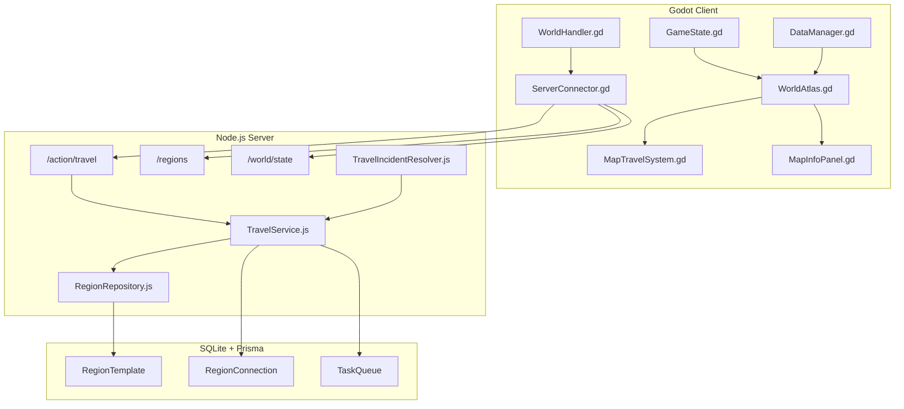
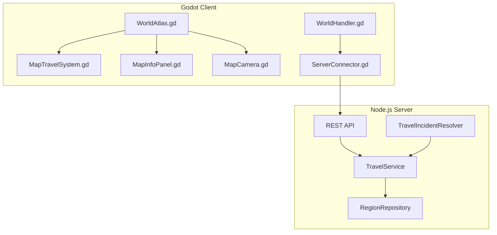
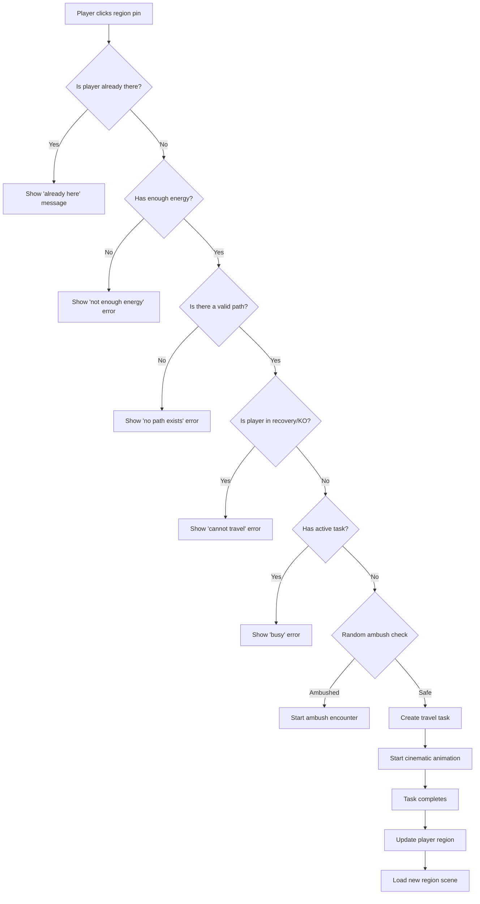

# Map System Documentation

**Version:** 1.0.0  
**Last Updated:** 2026-02-17  
**Status:** Fully Implemented  
**Game Engine:** Godot (Client) + Node.js (Server) + SQLite/Prisma (Database)

---

## Table of Contents

1. [Overview](#1-overview)
2. [Architecture](#2-architecture)
3. [Database Schema](#3-database-schema)
4. [Region Types & Visual Themes](#4-region-types--visual-themes)
5. [Travel System](#5-travel-system)
6. [Zone Classification](#6-zone-classification)
7. [Client Implementation](#7-client-implementation)
8. [API Reference](#8-api-reference)
9. [Map Grid System](#9-map-grid-system)
10. [Region Properties](#10-region-properties)
11. [Travel Incidents](#11-travel-incidents)

---

## 1. Overview

The Map System in Textical is a comprehensive world navigation framework that enables players to travel between different regions in the game world. It provides:

- **Node-based map navigation** - Players select destination regions from a visual world map
- **Cinematic travel animations** - Visual feedback during travel transitions  
- **Resource management** - Travel costs energy points
- **Region-based gameplay** - Different regions offer different activities, monsters, and resources
- **Zone danger systems** - Various threat levels from safe towns to deadly black zones

### 1.1 Core Features

| Feature | Status | Description |
|---------|--------|-------------|
| World Atlas Map | ✅ Implemented | Interactive world map with region pins |
| Region Selection | ✅ Implemented | Click on map pins to select destination |
| Travel Animation | ✅ Implemented | Cinematic path animation with camera follow |
| Energy Cost | ✅ Implemented | 5 energy per travel |
| Travel Duration | ✅ Implemented | 15 seconds server-side (configurable) |
| Region Types | ✅ Implemented | TOWN, WILDERNESS, DUNGEON |
| Visual Themes | ✅ Implemented | 25 different biome themes |
| Zone Classification | ✅ Implemented | GREEN, YELLOW, ORANGE, RED, BLACK, ROYAL |
| Fast Travel (Tavern) | ✅ Implemented | Teleport between Royal Cities |

---

## 2. Architecture

### 2.1 System Architecture



### 2.2 Component Overview



### 2.3 File Structure

```
client/
├── src/
│   ├── ui/
│   │   ├── WorldAtlas.gd          # Main map controller
│   │   ├── WorldAtlas.tscn        # Map scene structure
│   │   ├── MapTravelSystem.gd     # Travel animation logic
│   │   ├── MapCamera.gd           # Camera control
│   │   ├── MapInfoPanel.gd        # Region info display
│   │   └── AtlasBase.gd           # Base class for map screens
│   ├── network/
│   │   └── WorldHandler.gd        # Network API calls
│   └── autoload/
│       ├── game_state.gd           # Global state management
│       └── data_manager.gd         # Data caching & sync
└── assets/
    └── data/
        └── regions.json            # Region definitions (cached)

server/
├── src/
│   ├── services/
│   │   ├── travelService.js       # Server-side travel logic
│   │   └── tavernService.js       # Fast travel (tavern teleport)
│   ├── repositories/
│   │   └── regionRepository.js    # Region data access
│   ├── logic/world/
│   │   └── TravelIncidentResolver.js  # Bandit ambush & spirit encounters
│   ├── controllers/
│   │   ├── TravelController.js    # Travel API endpoint
│   │   └── RegionController.js   # Region API endpoint
│   └── routes/
│       └── api.js                 # Route definitions
└── prisma/
    └── schema.prisma              # Database schema
```

---

## 3. Database Schema

### 3.1 RegionTemplate Model

The `RegionTemplate` model is the core of the map system, containing **70+ fields** defining all region properties:

```prisma
model RegionTemplate {
  id                     Int           @id
  version                Int           @default(1)
  name                   String
  description            String
  visualType             String        @default("TOWN")
  traversalType          TraversalType @default(WALK)
  zoneType               String        @default("GREEN")
  zoneLevel              Int           @default(1)
  zoneColor              ZoneColor?
  isSafeZone             Boolean       @default(true)
  regionalTaxRate        Float         @default(0.10)
  weatherOverride        String?
  specialization         String?
  pvpMode                PvpMode       @default(SAFE)
  dangerLevel            Int           @default(1)
  // ... 60+ more fields
}
```

#### Core Fields

| Field | Type | Default | Description |
|-------|------|---------|-------------|
| `id` | Int | Auto | Primary key (region ID) |
| `name` | String | - | Display name |
| `description` | String | - | Lore description |
| `visualType` | String | "TOWN" | Visual theme (see Section 4) |
| `zoneType` | String | "GREEN" | Zone classification (GREEN/BLACK/etc) |
| `zoneLevel` | Int | 1 | Difficulty level (1-100) |
| `isSafeZone` | Boolean | true | No hostile encounters |
| `gridX` | Int | 0 | World grid X coordinate |
| `gridY` | Int | 0 | World grid Y coordinate |

#### Combat & Danger

| Field | Type | Default | Description |
|-------|------|---------|-------------|
| `dangerLevel` | Int | 1 | Encounter difficulty |
| `banditThreatLevel` | Float | 0.0 | Bandit ambush probability (0.0-1.0) |
| `spiritDensity` | Float | 0.0 | Spirit encounter rate (0.0-1.0) |
| `corruptionLevel` | Float | 0.0 | World corruption intensity |
| `sanctuaryPower` | Float | 0.0 | Safe zone protection |
| `pvpMode` | Enum | SAFE | PvP rules (SAFE/OPTIONAL/MANDATORY) |

#### Resources & Economy

| Field | Type | Default | Description |
|-------|------|---------|-------------|
| `resourceModifier` | Float | 1.0 | Gathering yield multiplier |
| `resourceScarcity` | Float | 1.0 | Resource availability (higher = rarer) |
| `marketDemandIndex` | Float | 1.0 | Local market prices |
| `regionalTaxRate` | Float | 0.10 | Transaction tax rate |
| `innRecoveryRate` | Float | 1.0 | Energy recovery speed |

#### Environment & Atmosphere

| Field | Type | Default | Description |
|-------|------|---------|-------------|
| `elementalAffinity` | String | "NEUTRAL" | Element type (FIRE, WATER, etc.) |
| `terrainAttackMod` | Float | 1.0 | Attack modifier in this terrain |
| `terrainDefenseMod` | Float | 1.0 | Defense modifier in this terrain |
| `weatherOverride` | String? | null | Fixed weather type |
| `fogDensity` | Float | 0.0 | Visual fog intensity |
| `particleEffectPack` | String? | null | Particle effects |
| `skyboxOverride` | String? | null | Skybox theme |

#### Requirements & Restrictions

| Field | Type | Default | Description |
|-------|------|---------|-------------|
| `requiredLevel` | Int | 1 | Minimum player level |
| `minRequiredUnits` | Int | 0 | Minimum party size (BLACK zones: 30) |
| `minRequiredHeroLevel` | Int | 1 | Minimum hero level |
| `reputationRequirement` | Int | 0 | Faction reputation needed |
| `respawnPenaltyMult` | Float | 1.0 | Death penalty multiplier |

### 3.2 RegionConnection Model

Defines travel routes between regions:

```prisma
model RegionConnection {
  id                Int            @id @default(autoincrement())
  originRegionId    Int
  targetRegionId    Int
  travelTimeSeconds Int            @default(15)
  target            RegionTemplate @relation("TargetRegion")
  origin            RegionTemplate @relation("OriginRegion")

  @@unique([originRegionId, targetRegionId])
}
```

| Field | Type | Description |
|-------|------|-------------|
| `originRegionId` | Int | Source region ID |
| `targetRegionId` | Int | Destination region ID |
| `travelTimeSeconds` | Int | Travel duration (default: 15s) |

### 3.3 TaskQueue Model

Tracks active travel tasks:

```prisma
model TaskQueue {
  id             Int      @id @default(autoincrement())
  userId         Int
  type           String   // "TRAVEL", "HAULING_STAY"
  status         String   // "RUNNING", "COMPLETED", "CANCELLED"
  originRegionId Int
  targetRegionId Int
  startedAt      DateTime
  finishesAt     DateTime
}
```

---

## 4. Region Types & Visual Themes

The game features **25 different visual themes** that create unique atmospheric experiences for each region. These are defined in [`docs/REGION_TYPES.md`](REGION_TYPES.md).

### 4.1 Visual Type Registry

| Type ID | Scene Name | Description |
|---------|------------|-------------|
| `TOWN` | TownScreen.tscn | Golden hour hub with menu grid |
| `FOREST` | ForestScreen.tscn | Deep green woods with fireflies (Default) |
| `MINE` | MineScreen.tscn | Dark tunnels with floating dust and ore glow |
| `DUNGEON` | DungeonScreen.tscn | Purple mystic vaults with magic mist |
| `RUINS` | RuinsScreen.tscn | Desaturated teal ruins with floating ash |
| `VOLCANO` | VolcanoScreen.tscn | Red/Black theme with rising fire embers |
| `DESERT` | DesertScreen.tscn | Golden sands with drifting wind particles |
| `SNOW` | SnowScreen.tscn | Frozen blue theme with falling snowflakes |
| `SWAMP` | SwampScreen.tscn | Murky green theme with thick toxic fog |
| `GRAVEYARD` | GraveyardScreen.tscn | Ghostly grey/purple theme with wisps |
| `OCEAN` | OceanScreen.tscn | Deep underwater blue theme with bubbles |
| `STORM` | StormScreen.tscn | Dark blue theme with constant rain |
| `AUTUMN` | AutumnScreen.tscn | Warm orange theme with falling maple leaves |
| `CORAL` | CoralScreen.tscn | Vibrant turquoise reef with bubbles |
| `ICE` | GlacierScreen.tscn | Pure white/cyan ice theme with frost dust |
| `LAVA` | LavaScreen.tscn | Deep magma tubes with fire particles |
| `FAIRY` | FairyScreen.tscn | Pastel pink glade with floating glitter |
| `ARENA` | ArenaScreen.tscn | Dusty colosseum theme with battle dust |
| `CASTLE` | CastleScreen.tscn | High-altitude blue theme with wind streaks |
| `SHIP` | ShipScreen.tscn | Rotten wood theme with spectral fog |
| `PRISON` | PrisonScreen.tscn | Cold iron and stone grey theme |
| `GIANT` | GiantScreen.tscn | Desolate brown wastes with bone dust |
| `HELL` | HellScreen.tscn | Crimson abyss with falling blood rain |
| `GARDEN` | GardenScreen.tscn | Vibrant paradise with falling flower petals |
| `WASTELAND` | WastelandScreen.tscn | Radioactive yellow theme with static noise |

### 4.2 How Visual Types Work

When creating a new Region in the database:
1. Set the `name` to anything you want (e.g., "Mount Drago")
2. Set the `visualType` to one of the **Type IDs** above (e.g., "VOLCANO")
3. The Godot client automatically loads the correct atmosphere when a player enters that region

---

## 5. Travel System

The Travel System enables players to navigate between different regions in the game world.

### 5.1 Travel Mechanics

| Parameter | Value | Description |
|-----------|-------|-------------|
| **Energy Cost** | 5 | Base energy required per travel |
| **Travel Duration** | 15 seconds | Default server-side time |
| **Mode** | NORMAL | Regular travel |
| **Hauling Mode** | 60 seconds | When transporting goods |

### 5.2 Travel Flow



### 5.3 Travel Validation Rules

The server performs the following validations before allowing travel:

1. **Player Status Check**
   - Player must not be unconscious (knocked out)
   - Player must not be in recovery window

2. **Resource Check**
   - Player must have at least 5 energy

3. **Task Check**
   - Player must not have any active tasks

4. **Path Check**
   - A `RegionConnection` must exist between current and target region

5. **Requirements Check**
   - Player must meet level requirements
   - Player must have minimum units for BLACK zones (30 units)
   - Player must have required faction reputation

### 5.4 Fast Travel (Tavern Teleport)

Players can teleport between Royal Cities via the tavern NPC:

- **Cost**: Varies by distance
- **Restrictions**: Only between ROYAL zone types
- **NPC**: Tavern keeper

---

## 6. Zone Classification

The world is divided into different zone types with varying danger levels:

### 6.1 Zone Types

| Zone Type | Color | Danger Level | Description |
|-----------|-------|--------------|-------------|
| `GREEN` | Green | 1-20 | Safe starter areas |
| `YELLOW` | Yellow | 21-40 | Moderate danger |
| `ORANGE` | Orange | 41-60 | High danger |
| `RED` | Red | 61-80 | Very dangerous |
| `BLACK` | Black | 81-100 | Extreme danger (min 30 units) |
| `ROYAL` | Gold | N/A | Safe cities with fast travel |

### 6.2 Zone Color Enum

```prisma
enum ZoneColor {
  GREEN
  YELLOW
  ORANGE
  RED
  BLACK
  ROYAL
}
```

### 6.3 PvP Modes

| Mode | Description |
|------|-------------|
| `SAFE` | No PvP allowed |
| `OPTIONAL` | PvP allowed with consent |
| `MANDATORY` | PvP always enabled |

---

## 7. Client Implementation

### 7.1 WorldAtlas (Main Map Controller)

The [`WorldAtlas.gd`](client/src/ui/WorldAtlas.gd) is the main map overlay controller that handles user interactions:

```gdscript
extends AtlasBase

@onready var travel_system = $MapLayer/PathGroup
@onready var ui_panel = $UI/InfoPanel

func setup_as_overlay(_data: Dictionary = {}):
    # Map must be full screen
    self.offset_left = 0
    _center_on_player()

func _ready():
    travel_system.camera = cam
    ui_panel.action_requested.connect(_on_action_requested)
    travel_system.travel_finished.connect(_on_travel_finished)
```

### 7.2 MapTravelSystem (Travel Animation)

The [`MapTravelSystem.gd`](client/src/ui/MapTravelSystem.gd) handles cinematic travel animation:

```gdscript
func start_cinematic(task_data: Dictionary):
    # Show travel path animation
    # Follow camera along path
    # When complete, emit travel_finished signal

signal travel_finished(target_region_id, target_region_type)
```

### 7.3 MapInfoPanel (Region Info Display)

The [`MapInfoPanel.gd`](client/src/ui/MapInfoPanel.gd) displays region details when a pin is clicked:

- Region name
- Region type
- Danger level
- Required level
- Travel cost

---

## 8. API Reference

### 8.1 Travel Endpoint

**Initiates travel to a target region.**

```
POST /api/action/travel
```

#### Request Body

```json
{
  "userId": 1,
  "targetRegionId": 2
}
```

#### Success Response (200 OK)

```json
{
  "success": true,
  "message": "Success",
  "data": {
    "id": 1001,
    "type": "TRAVEL",
    "status": "RUNNING",
    "startedAt": 1739312400000,
    "finishesAt": 1739312415000,
    "originRegionId": 1,
    "targetRegionId": 2,
    "targetRegion": {
      "id": 2,
      "name": "Forest of Beginnings",
      "visualType": "forest"
    },
    "targetRegionType": "WILDERNESS",
    "ambientSign": "You notice signs of bandit activity in the area...",
    "spiritEncounter": null
  }
}
```

#### Error Responses

| Status | Error Message | Condition |
|--------|---------------|-----------|
| 400 | `"You are unconscious and cannot travel."` | Player is knocked out |
| 400 | `"You must wait for your recovery window to end..."` | Player in recovery |
| 400 | `"User not found"` | Invalid user ID |
| 400 | `"You cannot start a journey while busy..."` | Active task exists |
| 400 | `"No direct path exists from here."` | No RegionConnection found |
| 400 | `"Black Zone Danger: You need minimum 30 units..."` | Black zone without 30+ units |
| 400 | `"Not enough Energy."` | Energy < 5 |

### 8.2 Get All Regions

**Retrieves list of all available regions.**

```
GET /api/regions
```

#### Query Parameters

| Parameter | Type | Required | Description |
|-----------|------|----------|-------------|
| `type` | string | No | Filter by type: `TOWN`, `WILDERNESS`, `DUNGEON` |

### 8.3 Get Region Details

**Retrieves detailed information about a specific region.**

```
GET /api/region/:id
```

### 8.4 Get World State

**Retrieves current world state information.**

```
GET /api/world/state
```

---

## 9. Map Grid System

The world uses a coordinate grid system for positioning regions:

### 9.1 Grid Coordinates

- **Grid X**: Horizontal position (0-34 in current map)
- **Grid Y**: Vertical position (0-23 in current map)

### 9.2 Map Terrain Types

The MAPS.json file defines different terrain types across the grid:

```json
{
  "WATER": {
    "traversal": "BOAT",
    "coordinates": [
      {"x": 0, "y": 0},
      {"x": 1, "y": 0}
    ]
  }
}
```

Available terrain types:
- `WATER` - Requires boat traversal
- `LAND` - Standard walking
- `MOUNTAIN` - Difficult traversal

---

## 10. Region Properties

### 10.1 Resource System

| Field | Type | Default | Description |
|-------|------|---------|-------------|
| `resourceModifier` | Float | 1.0 | Gathering yield multiplier |
| `resourceScarcity` | Float | 1.0 | Higher values = rarer resources |
| `gatheringStaminaCost` | Float | 1.0 | Stamina cost for gathering |

### 10.2 Economic Properties

| Field | Type | Default | Description |
|-------|------|---------|-------------|
| `regionalTaxRate` | Float | 0.10 | Transaction tax (10%) |
| `marketDemandIndex` | Float | 1.0 | Local price modifier |
| `marketDemandIndex` | Float | 1.0 | Price fluctuations |

### 10.3 Tavern & Recovery

| Field | Type | Default | Description |
|-------|------|---------|-------------|
| `hasInn` | Boolean | false | Has tavern for rest |
| `innTier` | Int | 1 | Tavern quality tier |
| `innRecoveryRate` | Float | 1.0 | Energy recovery multiplier |

---

## 11. Travel Incidents

### 11.1 Bandit Ambushes

During travel, players may encounter bandits based on the region's `banditThreatLevel`:

- **Ambush Chance**: Random check against `banditThreatLevel`
- **Ransom Cost**: 30% of player's silver
- **Resolution**: Pay ransom or fight

### 11.2 Spirit Encounters

Certain regions have `spiritDensity` that may trigger spirit encounters:

- **Nocturnal**: More common at night
- **Special Events**: May spawn rare spirits
- **Rewards**: Can grant buffs or items

### 11.3 Ambient Signs

Travel responses may include atmospheric messages:

```
"You notice signs of bandit activity in the area..."
"The forest seems unusually quiet..."
"Spirit lights dance in the distance..."
```

---

## Related Documentation

- [TRAVEL_SYSTEM.md](TRAVEL_SYSTEM.md) - Detailed travel system documentation
- [REGION_TYPES.md](REGION_TYPES.md) - Visual theme registry
- [API.md](API.md) - Complete API reference

---

## Version History

| Version | Date | Changes |
|---------|------|---------|
| 1.0.0 | 2026-02-17 | Initial documentation |

**Version:** 1.0.0  
**Last Updated:** 2026-02-17  
**Status:** Fully Implemented  
**Game Engine:** Godot (Client) + Node.js (Server) + SQLite/Prisma (Database)

---

## Table of Contents

1. [Overview](#1-overview)
2. [Architecture](#2-architecture)
3. [Database Schema](#3-database-schema)
4. [Region Types & Visual Themes](#4-region-types--visual-themes)
5. [Travel System](#5-travel-system)
6. [Zone Classification](#6-zone-classification)
7. [Client Implementation](#7-client-implementation)
8. [API Reference](#8-api-reference)
9. [Map Grid System](#9-map-grid-system)
10. [Region Properties](#10-region-properties)
11. [Travel Incidents](#11-travel-incidents)

---

## 1. Overview

The Map System in Textical is a comprehensive world navigation framework that enables players to travel between different regions in the game world. It provides:

- **Node-based map navigation** - Players select destination regions from a visual world map
- **Cinematic travel animations** - Visual feedback during travel transitions  
- **Resource management** - Travel costs energy points
- **Region-based gameplay** - Different regions offer different activities, monsters, and resources
- **Zone danger systems** - Various threat levels from safe towns to deadly black zones

### 1.1 Core Features

| Feature | Status | Description |
|---------|--------|-------------|
| World Atlas Map | ✅ Implemented | Interactive world map with region pins |
| Region Selection | ✅ Implemented | Click on map pins to select destination |
| Travel Animation | ✅ Implemented | Cinematic path animation with camera follow |
| Energy Cost | ✅ Implemented | 5 energy per travel |
| Travel Duration | ✅ Implemented | 15 seconds server-side (configurable) |
| Region Types | ✅ Implemented | TOWN, WILDERNESS, DUNGEON |
| Visual Themes | ✅ Implemented | 25 different biome themes |
| Zone Classification | ✅ Implemented | GREEN, YELLOW, ORANGE, RED, BLACK, ROYAL |
| Fast Travel (Tavern) | ✅ Implemented | Teleport between Royal Cities |

---

## 2. Architecture

### 2.1 System Architecture


### 2.2 Component Overview


### 2.3 File Structure

```
client/
├── src/
│   ├── ui/
│   │   ├── WorldAtlas.gd          # Main map controller
│   │   ├── WorldAtlas.tscn        # Map scene structure
│   │   ├── MapTravelSystem.gd     # Travel animation logic
│   │   ├── MapCamera.gd           # Camera control
│   │   ├── MapInfoPanel.gd        # Region info display
│   │   └── AtlasBase.gd           # Base class for map screens
│   ├── network/
│   │   └── WorldHandler.gd        # Network API calls
│   └── autoload/
│       ├── game_state.gd           # Global state management
│       └── data_manager.gd         # Data caching & sync
└── assets/
    └── data/
        └── regions.json            # Region definitions (cached)

server/
├── src/
│   ├── services/
│   │   ├── travelService.js       # Server-side travel logic
│   │   └── tavernService.js       # Fast travel (tavern teleport)
│   ├── repositories/
│   │   └── regionRepository.js    # Region data access
│   ├── logic/world/
│   │   └── TravelIncidentResolver.js  # Bandit ambush & spirit encounters
│   ├── controllers/
│   │   ├── TravelController.js    # Travel API endpoint
│   │   └── RegionController.js   # Region API endpoint
│   └── routes/
│       └── api.js                 # Route definitions
└── prisma/
    └── schema.prisma              # Database schema
```

---

## 3. Database Schema

### 3.1 RegionTemplate Model

The `RegionTemplate` model is the core of the map system, containing **70+ fields** defining all region properties:

```prisma
model RegionTemplate {
  id                     Int           @id
  version                Int           @default(1)
  name                   String
  description            String
  visualType             String        @default("TOWN")
  traversalType          TraversalType @default(WALK)
  zoneType               String        @default("GREEN")
  zoneLevel              Int           @default(1)
  zoneColor              ZoneColor?
  isSafeZone             Boolean       @default(true)
  regionalTaxRate        Float         @default(0.10)
  weatherOverride        String?
  specialization         String?
  pvpMode                PvpMode       @default(SAFE)
  dangerLevel            Int           @default(1)
  // ... 60+ more fields
}
```

#### Core Fields

| Field | Type | Default | Description |
|-------|------|---------|-------------|
| `id` | Int | Auto | Primary key (region ID) |
| `name` | String | - | Display name |
| `description` | String | - | Lore description |
| `visualType` | String | "TOWN" | Visual theme (see Section 4) |
| `zoneType` | String | "GREEN" | Zone classification (GREEN/BLACK/etc) |
| `zoneLevel` | Int | 1 | Difficulty level (1-100) |
| `isSafeZone` | Boolean | true | No hostile encounters |
| `gridX` | Int | 0 | World grid X coordinate |
| `gridY` | Int | 0 | World grid Y coordinate |

#### Combat & Danger

| Field | Type | Default | Description |
|-------|------|---------|-------------|
| `dangerLevel` | Int | 1 | Encounter difficulty |
| `banditThreatLevel` | Float | 0.0 | Bandit ambush probability (0.0-1.0) |
| `spiritDensity` | Float | 0.0 | Spirit encounter rate (0.0-1.0) |
| `corruptionLevel` | Float | 0.0 | World corruption intensity |
| `sanctuaryPower` | Float | 0.0 | Safe zone protection |
| `pvpMode` | Enum | SAFE | PvP rules (SAFE/OPTIONAL/MANDATORY) |

#### Resources & Economy

| Field | Type | Default | Description |
|-------|------|---------|-------------|
| `resourceModifier` | Float | 1.0 | Gathering yield multiplier |
| `resourceScarcity` | Float | 1.0 | Resource availability (higher = rarer) |
| `marketDemandIndex` | Float | 1.0 | Local market prices |
| `regionalTaxRate` | Float | 0.10 | Transaction tax rate |
| `innRecoveryRate` | Float | 1.0 | Energy recovery speed |

#### Environment & Atmosphere

| Field | Type | Default | Description |
|-------|------|---------|-------------|
| `elementalAffinity` | String | "NEUTRAL" | Element type (FIRE, WATER, etc.) |
| `terrainAttackMod` | Float | 1.0 | Attack modifier in this terrain |
| `terrainDefenseMod` | Float | 1.0 | Defense modifier in this terrain |
| `weatherOverride` | String? | null | Fixed weather type |
| `fogDensity` | Float | 0.0 | Visual fog intensity |
| `particleEffectPack` | String? | null | Particle effects |
| `skyboxOverride` | String? | null | Skybox theme |

#### Requirements & Restrictions

| Field | Type | Default | Description |
|-------|------|---------|-------------|
| `requiredLevel` | Int | 1 | Minimum player level |
| `minRequiredUnits` | Int | 0 | Minimum party size (BLACK zones: 30) |
| `minRequiredHeroLevel` | Int | 1 | Minimum hero level |
| `reputationRequirement` | Int | 0 | Faction reputation needed |
| `respawnPenaltyMult` | Float | 1.0 | Death penalty multiplier |

### 3.2 RegionConnection Model

Defines travel routes between regions:

```prisma
model RegionConnection {
  id                Int            @id @default(autoincrement())
  originRegionId    Int
  targetRegionId    Int
  travelTimeSeconds Int            @default(15)
  target            RegionTemplate @relation("TargetRegion")
  origin            RegionTemplate @relation("OriginRegion")

  @@unique([originRegionId, targetRegionId])
}
```

| Field | Type | Description |
|-------|------|-------------|
| `originRegionId` | Int | Source region ID |
| `targetRegionId` | Int | Destination region ID |
| `travelTimeSeconds` | Int | Travel duration (default: 15s) |

### 3.3 TaskQueue Model

Tracks active travel tasks:

```prisma
model TaskQueue {
  id             Int      @id @default(autoincrement())
  userId         Int
  type           String   // "TRAVEL", "HAULING_STAY"
  status         String   // "RUNNING", "COMPLETED", "CANCELLED"
  originRegionId Int
  targetRegionId Int
  startedAt      DateTime
  finishesAt     DateTime
}
```

---

## 4. Region Types & Visual Themes

The game features **25 different visual themes** that create unique atmospheric experiences for each region. These are defined in [`docs/REGION_TYPES.md`](REGION_TYPES.md).

### 4.1 Visual Type Registry

| Type ID | Scene Name | Description |
|---------|------------|-------------|
| `TOWN` | TownScreen.tscn | Golden hour hub with menu grid |
| `FOREST` | ForestScreen.tscn | Deep green woods with fireflies (Default) |
| `MINE` | MineScreen.tscn | Dark tunnels with floating dust and ore glow |
| `DUNGEON` | DungeonScreen.tscn | Purple mystic vaults with magic mist |
| `RUINS` | RuinsScreen.tscn | Desaturated teal ruins with floating ash |
| `VOLCANO` | VolcanoScreen.tscn | Red/Black theme with rising fire embers |
| `DESERT` | DesertScreen.tscn | Golden sands with drifting wind particles |
| `SNOW` | SnowScreen.tscn | Frozen blue theme with falling snowflakes |
| `SWAMP` | SwampScreen.tscn | Murky green theme with thick toxic fog |
| `GRAVEYARD` | GraveyardScreen.tscn | Ghostly grey/purple theme with wisps |
| `OCEAN` | OceanScreen.tscn | Deep underwater blue theme with bubbles |
| `STORM` | StormScreen.tscn | Dark blue theme with constant rain |
| `AUTUMN` | AutumnScreen.tscn | Warm orange theme with falling maple leaves |
| `CORAL` | CoralScreen.tscn | Vibrant turquoise reef with bubbles |
| `ICE` | GlacierScreen.tscn | Pure white/cyan ice theme with frost dust |
| `LAVA` | LavaScreen.tscn | Deep magma tubes with fire particles |
| `FAIRY` | FairyScreen.tscn | Pastel pink glade with floating glitter |
| `ARENA` | ArenaScreen.tscn | Dusty colosseum theme with battle dust |
| `CASTLE` | CastleScreen.tscn | High-altitude blue theme with wind streaks |
| `SHIP` | ShipScreen.tscn | Rotten wood theme with spectral fog |
| `PRISON` | PrisonScreen.tscn | Cold iron and stone grey theme |
| `GIANT` | GiantScreen.tscn | Desolate brown wastes with bone dust |
| `HELL` | HellScreen.tscn | Crimson abyss with falling blood rain |
| `GARDEN` | GardenScreen.tscn | Vibrant paradise with falling flower petals |
| `WASTELAND` | WastelandScreen.tscn | Radioactive yellow theme with static noise |

### 4.2 How Visual Types Work

When creating a new Region in the database:
1. Set the `name` to anything you want (e.g., "Mount Drago")
2. Set the `visualType` to one of the **Type IDs** above (e.g., "VOLCANO")
3. The Godot client automatically loads the correct atmosphere when a player enters that region

---

## 5. Travel System

The Travel System enables players to navigate between different regions in the game world.

### 5.1 Travel Mechanics

| Parameter | Value | Description |
|-----------|-------|-------------|
| **Energy Cost** | 5 | Base energy required per travel |
| **Travel Duration** | 15 seconds | Default server-side time |
| **Mode** | NORMAL | Regular travel |
| **Hauling Mode** | 60 seconds | When transporting goods |

### 5.2 Travel Flow


### 5.3 Travel Validation Rules

The server performs the following validations before allowing travel:

1. **Player Status Check**
   - Player must not be unconscious (knocked out)
   - Player must not be in recovery window

2. **Resource Check**
   - Player must have at least 5 energy

3. **Task Check**
   - Player must not have any active tasks

4. **Path Check**
   - A `RegionConnection` must exist between current and target region

5. **Requirements Check**
   - Player must meet level requirements
   - Player must have minimum units for BLACK zones (30 units)
   - Player must have required faction reputation

### 5.4 Fast Travel (Tavern Teleport)

Players can teleport between Royal Cities via the tavern NPC:

- **Cost**: Varies by distance
- **Restrictions**: Only between ROYAL zone types
- **NPC**: Tavern keeper

---

## 6. Zone Classification

The world is divided into different zone types with varying danger levels:

### 6.1 Zone Types

| Zone Type | Color | Danger Level | Description |
|-----------|-------|--------------|-------------|
| `GREEN` | Green | 1-20 | Safe starter areas |
| `YELLOW` | Yellow | 21-40 | Moderate danger |
| `ORANGE` | Orange | 41-60 | High danger |
| `RED` | Red | 61-80 | Very dangerous |
| `BLACK` | Black | 81-100 | Extreme danger (min 30 units) |
| `ROYAL` | Gold | N/A | Safe cities with fast travel |

### 6.2 Zone Color Enum

```prisma
enum ZoneColor {
  GREEN
  YELLOW
  ORANGE
  RED
  BLACK
  ROYAL
}
```

### 6.3 PvP Modes

| Mode | Description |
|------|-------------|
| `SAFE` | No PvP allowed |
| `OPTIONAL` | PvP allowed with consent |
| `MANDATORY` | PvP always enabled |

---

## 7. Client Implementation

### 7.1 WorldAtlas (Main Map Controller)

The [`WorldAtlas.gd`](client/src/ui/WorldAtlas.gd) is the main map overlay controller that handles user interactions:

```gdscript
extends AtlasBase

@onready var travel_system = $MapLayer/PathGroup
@onready var ui_panel = $UI/InfoPanel

func setup_as_overlay(_data: Dictionary = {}):
    # Map must be full screen
    self.offset_left = 0
    _center_on_player()

func _ready():
    travel_system.camera = cam
    ui_panel.action_requested.connect(_on_action_requested)
    travel_system.travel_finished.connect(_on_travel_finished)
```

### 7.2 MapTravelSystem (Travel Animation)

The [`MapTravelSystem.gd`](client/src/ui/MapTravelSystem.gd) handles cinematic travel animation:

```gdscript
func start_cinematic(task_data: Dictionary):
    # Show travel path animation
    # Follow camera along path
    # When complete, emit travel_finished signal

signal travel_finished(target_region_id, target_region_type)
```

### 7.3 MapInfoPanel (Region Info Display)

The [`MapInfoPanel.gd`](client/src/ui/MapInfoPanel.gd) displays region details when a pin is clicked:

- Region name
- Region type
- Danger level
- Required level
- Travel cost

---

## 8. API Reference

### 8.1 Travel Endpoint

**Initiates travel to a target region.**

```
POST /api/action/travel
```

#### Request Body

```json
{
  "userId": 1,
  "targetRegionId": 2
}
```

#### Success Response (200 OK)

```json
{
  "success": true,
  "message": "Success",
  "data": {
    "id": 1001,
    "type": "TRAVEL",
    "status": "RUNNING",
    "startedAt": 1739312400000,
    "finishesAt": 1739312415000,
    "originRegionId": 1,
    "targetRegionId": 2,
    "targetRegion": {
      "id": 2,
      "name": "Forest of Beginnings",
      "visualType": "forest"
    },
    "targetRegionType": "WILDERNESS",
    "ambientSign": "You notice signs of bandit activity in the area...",
    "spiritEncounter": null
  }
}
```

#### Error Responses

| Status | Error Message | Condition |
|--------|---------------|-----------|
| 400 | `"You are unconscious and cannot travel."` | Player is knocked out |
| 400 | `"You must wait for your recovery window to end..."` | Player in recovery |
| 400 | `"User not found"` | Invalid user ID |
| 400 | `"You cannot start a journey while busy..."` | Active task exists |
| 400 | `"No direct path exists from here."` | No RegionConnection found |
| 400 | `"Black Zone Danger: You need minimum 30 units..."` | Black zone without 30+ units |
| 400 | `"Not enough Energy."` | Energy < 5 |

### 8.2 Get All Regions

**Retrieves list of all available regions.**

```
GET /api/regions
```

#### Query Parameters

| Parameter | Type | Required | Description |
|-----------|------|----------|-------------|
| `type` | string | No | Filter by type: `TOWN`, `WILDERNESS`, `DUNGEON` |

### 8.3 Get Region Details

**Retrieves detailed information about a specific region.**

```
GET /api/region/:id
```

### 8.4 Get World State

**Retrieves current world state information.**

```
GET /api/world/state
```

---

## 9. Map Grid System

The world uses a coordinate grid system for positioning regions:

### 9.1 Grid Coordinates

- **Grid X**: Horizontal position (0-34 in current map)
- **Grid Y**: Vertical position (0-23 in current map)

### 9.2 Map Terrain Types

The MAPS.json file defines different terrain types across the grid:

```json
{
  "WATER": {
    "traversal": "BOAT",
    "coordinates": [
      {"x": 0, "y": 0},
      {"x": 1, "y": 0}
    ]
  }
}
```

Available terrain types:
- `WATER` - Requires boat traversal
- `LAND` - Standard walking
- `MOUNTAIN` - Difficult traversal

---

## 10. Region Properties

### 10.1 Resource System

| Field | Type | Default | Description |
|-------|------|---------|-------------|
| `resourceModifier` | Float | 1.0 | Gathering yield multiplier |
| `resourceScarcity` | Float | 1.0 | Higher values = rarer resources |
| `gatheringStaminaCost` | Float | 1.0 | Stamina cost for gathering |

### 10.2 Economic Properties

| Field | Type | Default | Description |
|-------|------|---------|-------------|
| `regionalTaxRate` | Float | 0.10 | Transaction tax (10%) |
| `marketDemandIndex` | Float | 1.0 | Local price modifier |
| `marketDemandIndex` | Float | 1.0 | Price fluctuations |

### 10.3 Tavern & Recovery

| Field | Type | Default | Description |
|-------|------|---------|-------------|
| `hasInn` | Boolean | false | Has tavern for rest |
| `innTier` | Int | 1 | Tavern quality tier |
| `innRecoveryRate` | Float | 1.0 | Energy recovery multiplier |

---

## 11. Travel Incidents

### 11.1 Bandit Ambushes

During travel, players may encounter bandits based on the region's `banditThreatLevel`:

- **Ambush Chance**: Random check against `banditThreatLevel`
- **Ransom Cost**: 30% of player's silver
- **Resolution**: Pay ransom or fight

### 11.2 Spirit Encounters

Certain regions have `spiritDensity` that may trigger spirit encounters:

- **Nocturnal**: More common at night
- **Special Events**: May spawn rare spirits
- **Rewards**: Can grant buffs or items

### 11.3 Ambient Signs

Travel responses may include atmospheric messages:

```
"You notice signs of bandit activity in the area..."
"The forest seems unusually quiet..."
"Spirit lights dance in the distance..."
```

---

## Related Documentation

- [TRAVEL_SYSTEM.md](TRAVEL_SYSTEM.md) - Detailed travel system documentation
- [REGION_TYPES.md](REGION_TYPES.md) - Visual theme registry
- [API.md](API.md) - Complete API reference

---

## Version History

| Version | Date | Changes |
|---------|------|---------|
| 1.0.0 | 2026-02-17 | Initial documentation |

