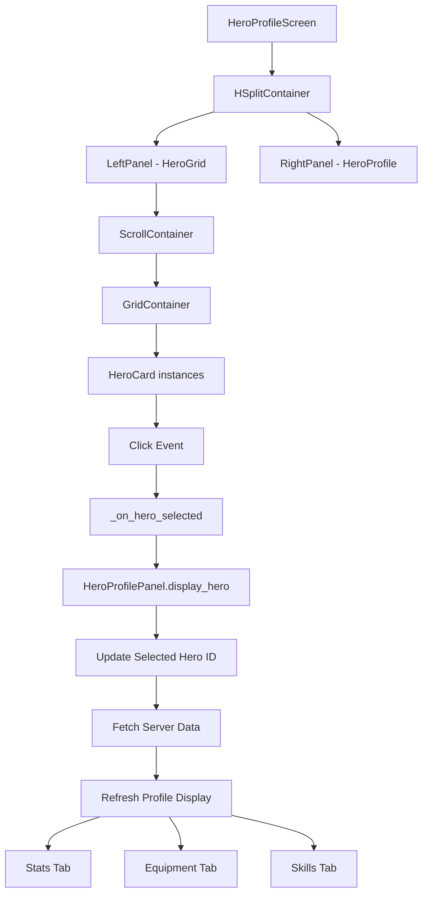

# HeroProfileScreen Redesign Plan

## Ringkasan Fitur

Redesain UI HeroProfileScreen dengan layout split panel yang menampilkan:
- **Kiri**: Grid hero dengan gambar, rarity color indicator, dan info ringkas
- **Kanan**: Profile detail dengan equipment modification panel

---

## Struktur UI Baru

```
HeroProfileScreen
├── Background (ColorRect - dark theme)
├── TopHUD
├── TaskListHUD
├── BottomHUD
├── MarginContainer (main content area)
│   └── HSplitContainer (split panel layout)
│       ├── LeftPanel (HeroGridContainer) - 40%
│       │   ├── Header (Label: "Heroes")
│       │   ├── ScrollContainer
│       │   │   └── GridContainer (hero cards)
│       │   └── FilterPanel (optional)
│       └── RightPanel (HeroProfilePanel) - 60%
│           ├── HeroHeader (avatar, name, level, class)
│           ├── TabContainer
│           │   ├── StatsTab
│           │   ├── EquipmentTab
│           │   └── SkillsTab
│           └── ActionButtons
```

---

## Rarity Color System

Berdasarkan `InventoryScreen.gd` `_get_rarity_color()`:

| Rarity | Color | Border Glow |
|--------|-------|-------------|
| COMMON | White/Gray (#CCCCCC) | None |
| RARE | Gold (#FFC800) | Subtle |
| EPIC | Purple (#9933FF) | Medium |
| LEGENDARY | Orange (#FF6600) | Strong |
| MYTHIC | Red (#FF0000) | Intense pulse |

---

## Component Breakdown

### 1. HeroCard.tscn
```
HeroCard (Button/TextureButton)
├── BorderFrame (ColorRect - rarity color)
├── Background (TextureRect - hero image placeholder)
├── AvatarInitial (Label - first letter of name)
├── InfoContainer (VBoxContainer)
│   ├── NameLabel (Label)
│   ├── LevelClassLabel (Label)
│   └── RarityLabel (Label - optional)
└── SelectionIndicator (ColorRect - shows when selected)
```

### 2. HeroGridContainer.tscn
```
HeroGridContainer (PanelContainer)
├── Header (HBoxContainer)
│   ├── TitleLabel (Label: "My Heroes")
│   └── CountLabel (Label: "X heroes")
├── ScrollContainer
│   └── GridContainer
│       ├── HeroCard1
│       ├── HeroCard2
│       └── ... (dynamically populated)
└── FilterBar (HBoxContainer - optional)
    ├── AllFilterButton
    ├── RarityFilterDropdown
    └── ClassFilterDropdown
```

### 3. HeroProfilePanel.tscn
```
HeroProfilePanel (PanelContainer)
├── HeroHeaderSection (HBoxContainer)
│   ├── AvatarFrame (TextureRect - large)
│   ├── InfoSection (VBoxContainer)
│   │   ├── NameLabel (large, styled)
│   │   ├── LevelLabel
│   │   ├── ClassLabel
│   │   └── StatsSummary (HP, MP, ATK, etc.)
│   └── ActionButtons (VBoxContainer)
│       ├── EditButton
│       ├── EquipButton
│       └── MoreOptionsButton
├── TabContainer
│   ├── StatsTab (VBoxContainer)
│   │   ├── MainStatsSection
│   │   ├── ElementalAffinitiesSection
│   │   └── SetBonusesSection
│   ├── EquipmentTab (HBoxContainer)
│   │   ├── EquipmentSlots (GridContainer)
│   │   │   ├── HeadSlot
│   │   │   ├── BodySlot
│   │   │   ├── WeaponSlot
│   │   │   └── ... (all equipment slots)
│   │   └── ItemInfoPanel
│   └── SkillsTab (VBoxContainer)
│       ├── ActiveSkillsSection
│       └── PassiveSkillsSection
└── ComparisonPanel (optional - shows stat changes)
```

---

## Implementasi Steps

### Step 1: Create HeroCard Component
**Files to create:**
- `client/src/ui/components/HeroCard.gd`
- `client/src/ui/components/HeroCard.tscn`

**Functionality:**
- Display hero avatar/name/level/class
- Show rarity color border and glow effect
- Handle click selection
- Hover animation effects
- Connect to GameState.selected_hero_id

### Step 2: Create HeroGridContainer Component
**Files to create:**
- `client/src/ui/components/HeroGridContainer.gd`
- `client/src/ui/components/HeroGridContainer.tscn`

**Functionality:**
- Fetch heroes from GameState.current_heroes
- Dynamically populate HeroCard instances
- Handle hero selection
- Optional filtering by rarity/class
- Scrollable grid layout

### Step 3: Create HeroProfilePanel Component
**Files to create:**
- `client/src/ui/components/HeroProfilePanel.gd`
- `client/src/ui/components/HeroProfilePanel.tscn`

**Functionality:**
- Display selected hero details
- Tabs for Stats, Equipment, Skills
- Equipment slot visualization
- Stat comparison view
- Connect to server signals for real-time updates

### Step 4: Redesign HeroProfileScreen.tscn
**Files to modify:**
- `client/src/ui/HeroProfileScreen.tscn` - replace VBoxContainer with HSplitContainer
- `client/src/ui/HeroProfileScreen.gd` - update logic for split panel

**New Structure:**
```gdscript
extends Control

@onready var split_container = $MarginContainer/HSplitContainer
@onready var hero_grid = $MarginContainer/HSplitContainer/LeftPanel/HeroGridContainer
@onready var hero_profile = $MarginContainer/HSplitContainer/RightPanel/HeroProfilePanel

func _ready():
    hero_grid.hero_selected.connect(_on_hero_selected)
    _load_all_heroes()

func _on_hero_selected(hero_data):
    hero_profile.display_hero(hero_data)
    GameState.selected_hero_id = hero_data.id
```

### Step 5: Add Visual Effects
**Enhancements:**
- Rarity color glow animation (pulse effect for high rarity)
- Hover scale animation on HeroCard
- Smooth transition when switching heroes
- Particle effects for legendary+ heroes (optional)
- Background gradient similar to InventoryScreen

### Step 6: Integrate with Existing Systems
**Connections:**
- `ServerConnector.stats_updated` signal
- `ServerConnector.equipment_updated` signal
- `GameState.selected_hero_id` changes
- Existing stat display components (`StatDisplay.gd`, `StatComparison.gd`, `StatAllocation.gd`)

---

## File Structure After Redesign

```
client/src/ui/
├── HeroProfileScreen.tscn (redesigned)
├── HeroProfileScreen.gd (updated)
└── components/
    ├── HeroCard.gd (new)
    ├── HeroCard.tscn (new)
    ├── HeroGridContainer.gd (new)
    ├── HeroGridContainer.tscn (new)
    ├── HeroProfilePanel.gd (new)
    └── HeroProfilePanel.tscn (new)
```

---

## Mermaid Diagram - UI Flow



---

## Asumsi Desain

1. **Hero Images**: Menggunakan placeholder dengan initial letter jika gambar tidak tersedia
2. **Grid Layout**: 4 kolom dengan scrollable jika lebih dari 8 heroes
3. **Split Ratio**: 40% kiri (grid), 60% kanan (profile) - adjustable
4. **Rarity Colors**: Mengikuti sistem yang sudah ada di InventoryScreen
5. **Tab System**: Stats, Equipment, Skills - mudah diextend

---

## Risiko dan Edge Cases

1. **Empty State**: Tampilkan pesan "No heroes found" jika GameState kosong
2. **Loading State**: Tampilkan loading spinner saat fetch data dari server
3. **Selection State**: Highlight hero yang sedang dipilih
4. **Responsive**: HSplitContainer harus bisa di-resize
5. **Server Offline**: Graceful fallback ke cached data

---

## Catatan untuk Developer

- Component baru harus extend Control atau PanelContainer
- Gunakan existing signals dari ServerConnector
- Reuse StatDisplay, StatComparison, StatAllocation components
- Ikuti style guide dari InventoryScreen dan TavernScreen
- Testing dengan 0, 1, dan multiple heroes
