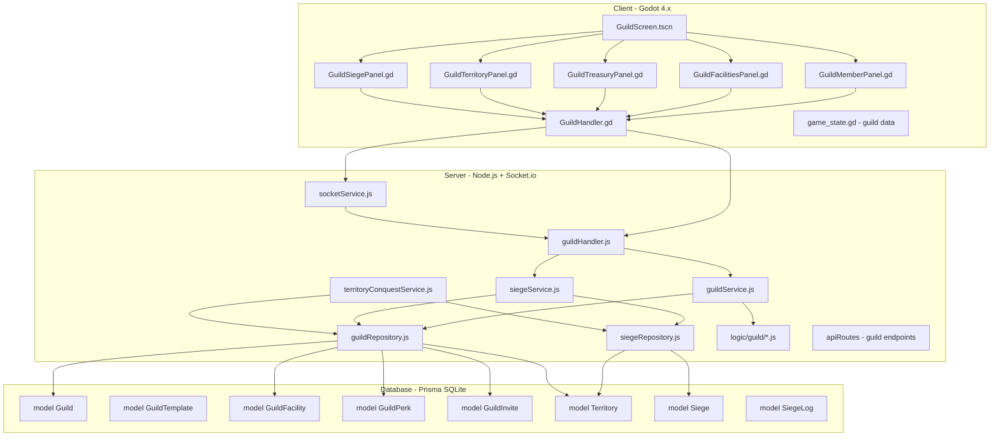

# Guild System Implementation Plan

## Overview

Build a complete guild system for Textical with all management features, facilities, treasury, territories, and siege mechanics.

## Architecture



## Phase 1: Backend Enhancement

### 1.1 Enhance guildService.js

Add these methods:
- `leaveGuild(user)` - Member leaves guild
- `kickMember(leader, targetUserId)` - Leader removes member
- `promoteMember(leader, targetUserId, newRole)` - Change member role
- `demoteMember(leader, targetUserId)` - Demote to lower role
- `transferLeadership(leader, targetUserId)` - Transfer master role
- `updateGuildSettings(leader, settings)` - Update description, etc.
- `depositTreasury(user, amount)` - Add to guild treasury
- `withdrawTreasury(leader, amount)` - Withdraw from treasury
- `buildFacility(guildId, facilityTemplateId)` - Build facility
- `upgradeFacility(guildId, facilityId)` - Upgrade facility
- `createInvite(user)` - Generate invite code
- `acceptInvite(user, inviteCode)` - Join via invite
- `cancelInvite(inviter, inviteId)` - Cancel invite
- `getGuildInfo(guildId)` - Full guild data
- `getMyGuild(userId)` - Get user's guild
- `searchGuilds(query)` - Find guilds
- `disbandGuild(leader)` - Delete guild

### 1.2 Enhance guildRepository.js

Add these methods:
- `findByIdWithDetails(id)` - Include members, facilities, perks, treasury, territories
- `findByIdWithMembers(id)` - Include member details
- `findByIdWithFacilities(id)` - Include facility details
- `updateTreasury(guildId, amount)` - Atomic treasury update
- `addMember(guildId, userId, role)` - Add member
- `removeMember(guildId, userId)` - Remove member
- `updateMemberRole(guildId, userId, role)` - Update role
- `createFacility(guildId, templateId)` - Build facility
- `updateFacilityLevel(facilityId, newLevel)` - Upgrade facility
- `deleteFacility(facilityId)` - Remove facility
- `createInvite(guildId, invitedByUserId)` - Create invite
- `findInviteByCode(code)` - Find invite
- `deleteInvite(inviteId)` - Cancel invite
- `getGuildMembers(guildId)` - Get all members
- `getGuildFacilities(guildId)` - Get all facilities
- `getGuildTerritories(guildId)` - Get territories
- `searchByName(query)` - Search guilds

### 1.3 Extend guildHandler.js

Add socket handlers:
- `handleLeaveGuild(ws, request)`
- `handleKickMember(ws, request)`
- `handlePromoteMember(ws, request)`
- `handleDemoteMember(ws, request)`
- `handleTransferLeadership(ws, request)`
- `handleUpdateSettings(ws, request)`
- `handleDepositTreasury(ws, request)`
- `handleWithdrawTreasury(ws, request)`
- `handleBuildFacility(ws, request)`
- `handleUpgradeFacility(ws, request)`
- `handleCreateInvite(ws, request)`
- `handleAcceptInvite(ws, request)`
- `handleCancelInvite(ws, request)`
- `handleGetGuildInfo(ws, request)`
- `handleSearchGuilds(ws, request)`
- `handleDisbandGuild(ws, request)`

### 1.4 Register guild handlers in socketService.js

```javascript
// In socketService.js, after chatHandler registration
const guildHandler = require('../handlers/guildHandler');

// In authenticate callback:
guildHandler.register(this.io, socket, userId);
```

### 1.5 Add guild API endpoints

In `server/src/routes/api.js`:
- `GET /api/guilds` - List all guilds
- `GET /api/guilds/:id` - Get guild details
- `GET /api/guilds/search?q=...` - Search guilds
- `GET /api/my/guild` - Get user's guild
- `POST /api/guilds/invites/:code/accept` - Accept invite
- `GET /api/guild-templates` - List guild templates

### 1.6 Enhance guild data sync

In `dataSyncService.js`:
- Add guild data to initial sync
- Add guild update events
- Add facility buff updates to stat calculations

## Phase 2: Client-Side Implementation

### 2.1 Create GuildHandler.gd

Location: `client/src/network/GuildHandler.gd`

Methods:
- `create_guild(template_id, name, description)`
- `leave_guild()`
- `kick_member(user_id)`
- `promote_member(user_id, role)`
- `demote_member(user_id)`
- `transfer_leadership(user_id)`
- `update_settings(description)`
- `deposit_treasury(amount)`
- `withdraw_treasury(amount)`
- `build_facility(template_id)`
- `upgrade_facility(facility_id)`
- `create_invite()`
- `accept_invite(code)`
- `cancel_invite(invite_id)`
- `get_guild_info(guild_id)`
- `search_guilds(query)`
- `disband_guild()`

### 2.2 Create GuildScreen.tscn/gd

Location: `client/src/ui/GuildScreen.tscn` and `GuildScreen.gd`

Tabs:
1. **Overview** - Guild info, level, treasury, members count
2. **Members** - List all members with roles, online status
3. **Facilities** - Build/upgrade facilities, view buffs
4. **Treasury** - Deposit/withdraw gold, view transactions
5. **Territories** - View controlled regions
6. **Settings** - Edit description, disband option

### 2.3 Create UI Components

- `GuildMemberPanel.gd` - Individual member display with actions
- `GuildFacilitiesPanel.gd` - Facility grid with upgrade buttons
- `GuildTreasuryPanel.gd` - Treasury controls and history
- `GuildTerritoryPanel.gd` - Map of controlled territories

### 2.4 Integrate with game_state.gd

Add guild data structure:
```gdscript
var current_guild: Dictionary = {}
var guild_members: Array = []
var guild_facilities: Array = []
var guild_buffs: Dictionary = {}
```

Add helper methods:
- `get_guild_role()` - Returns user's role in guild
- `is_guild_master()` - Check if user is leader
- `is_guild_officer()` - Check if user is officer
- `has_guild_perk(perk_key)` - Check perk availability

### 2.5 Add guild navigation to BottomHUD

In `BottomHUD.gd`, add guild button that opens GuildScreen when user is in a guild.

## Phase 3: Database Extensions

### 3.1 Add GuildInvite model to schema.prisma

```prisma
model GuildInvite {
  id          Int      @id @default(autoincrement())
  guildId     Int
  guild       Guild    @relation(fields: [guildId], references: [id])
  invitedById Int
  invitedBy   User     @relation(fields: [invitedById], references: [id])
  inviteCode  String   @unique
  expiresAt   DateTime
  isUsed      Boolean  @default(false)
  usedAt      DateTime?
  
  @@unique([guildId, invitedById])
}
```

### 3.2 Add GuildVault model

```prisma
model GuildVault {
  id          Int      @id @default(autoincrement())
  guildId     Int      @unique
  guild       Guild    @relation(fields: [guildId], references: [id])
  slots       Int      @default(50)
  items       GuildVaultItem[]
}

model GuildVaultItem {
  id          Int      @id @default(autoincrement())
  vaultId     Int
  vault       GuildVault @relation(fields: [vaultId], references: [id])
  itemTemplateId Int
  itemTemplate ItemTemplate @relation(fields: [itemTemplateId], references: [id])
  quantity    Int      @default(1)
  slotIndex   Int      @default(0)
  depositedBy Int
  depositedAt DateTime @default(now())
  
  @@unique([vaultId, slotIndex])
}
```

### 3.3 Add GuildMemberRole enum (handled via String)

Update User model to include:
```prisma
guildRole String?  // MASTER, OFFICER, MEMBER, RECRUIT
```

### 3.3 Run migrations

```bash
cd server && npx prisma migrate dev --name guild_invite_system
```

## Phase 4: Guild Features

### 4.1 Role System

Roles and permissions:
- **MASTER**: Full control, can promote/demote, transfer leadership, disband
- **OFFICER**: Can invite, kick members, manage facilities, treasury withdrawal
- **MEMBER**: Can view guild info, deposit to treasury, use facilities
- **RECRUIT**: Limited access, pending approval

### 4.2 Treasury System

- Dual currency support (gold/silver)
- Deposit/withdraw with role restrictions
- Transaction logging in TransactionLedger
- Tax rates from guild template

### 4.3 Facility System

Facility types:
- **Training Grounds** - Combat XP bonus
- **Workshop** - Crafting speed bonus
- **Market** - Trading fee reduction
- **Healing Spring** - Vitality regeneration
- **Library** - Skill XP bonus
- **Vault** - Increased storage

Each facility has:
- Level (1-10)
- Upgrade cost (scales with level)
- Effects (scale with level)

### 4.4 Territory System

- Guilds can own territories via siege
- Territories generate passive income
- Fortification system for defense
- Siege events for conquest

### 4.5 Siege Mechanics

#### Siege Types
- **Conquest Siege**: Attack enemy territory to capture it
- **Defense Siege**: Defend your territory against attackers
- **Neutral Siege**: Attack unclaimed neutral territory

#### Siege Requirements
- **Attacker Requirements**:
  - Guild level ≥ 3
  - Treasury has sufficient siege cost (500-2000 gold based on territory level)
  - Guild has at least 5 online members
  - No active siege in progress
- **Defender Requirements**:
  - Territory must be owned by a guild
  - Fortification level determines defense bonus

#### Siege Process
1. **Declaration Phase** (24 hours before siege)
   - Attacker guild declares siege
   - Treasury deducts siege cost
   - Server broadcasts siege notification
   - Defender guild has time to prepare

2. **Preparation Phase** (1 hour before siege)
   - Both sides can rally champions
   - Guild members can contribute to defense/offense bonuses
   - Fortifications can be repaired

3. **Battle Phase** (30 minutes active combat)
   - 5 rounds of tactical combat
   - Each round: Top 5 heroes from each guild battle
   - Winner: Best of 5 rounds
   - Ties go to defenders

4. **Resolution Phase**
   - Winner captures territory (if attacker wins)
   - Territory ownership transfers
   - Fortification resets to 50%
   - Siege logs recorded

#### Fortification System
- Each territory has fortification points (max 1000)
- Fortification provides defense bonus in siege battles
- Fortification decays 5% per week
- Members can donate gold to repair fortification
- Repair cost: 1 gold per 10 fortification points

#### Territory Benefits
- **Passive Income**: 10% of all market transactions in territory
- **Tax Reduction**: Members get reduced regional taxes
- **Exclusive Resources**: Access to territory-specific gathering nodes
- **Spawn Protection**: Enemy monsters don't spawn in owned territories
- **Teleport Network**: Members can fast-travel within owned territories

#### Territory Tiers
| Tier | Min Level | Income Multiplier | Defense Bonus | Required Siege Cost |
|------|-----------|-------------------|---------------|---------------------|
| 1    | 1         | 1.0x              | +10%          | 500 gold            |
| 2    | 3         | 1.5x              | +20%          | 800 gold            |
| 3    | 5         | 2.0x              | +30%          | 1200 gold           |
| 4    | 7         | 3.0x              | +40%          | 1500 gold           |
| 5    | 10        | 5.0x              | +50%          | 2000 gold           |

### 4.6 Perk System

Unlocked at certain guild levels:
- Increased member capacity
- Reduced crafting costs
- Bonus experience
- Exclusive items
- Custom guild tag

### 4.7 Guild Vault System

#### Overview
The guild vault provides shared item storage for all guild members. Items deposited are accessible to authorized members.

#### Vault Features
- **Shared Storage**: All members can access the vault
- **Permission Levels**: Different roles have different access
- **Deposit/Withdraw**: Members can deposit and withdraw items
- **Logging**: All transactions are logged
- **Capacity**: Base 50 slots, expandable via Vault facility

#### Vault Permissions by Role
| Role | View Items | Deposit | Withdraw |
|------|------------|---------|----------|
| MASTER | ✅ | ✅ | ✅ |
| OFFICER | ✅ | ✅ | ✅ |
| MEMBER | ✅ | ✅ | ❌ |
| RECRUIT | ✅ | ❌ | ❌ |

#### Vault Operations
- **Deposit**: Any member (except RECRUIT) can deposit items
- **Withdraw**: Only MASTER and OFFICER can withdraw
- **Move**: Move items within vault slots
- **Split**: Split stacked items

#### Vault Facility Bonus
The **Vault** facility provides:
- Level 1: +20 slots
- Level 2: +40 slots
- Level 3: +80 slots
- Level 4: +160 slots
- Level 5: Unlimited slots

#### API Endpoints
| Socket Event | Description | Required Role |
|--------------|-------------|---------------|
| `vault:get_items` | Get all vault items | Any member |
| `vault:deposit` | Deposit item to vault | Member+ |
| `vault:withdraw` | Withdraw item from vault | Officer+ |
| `vault:move` | Move item within vault | Officer+ |

#### Server Events
| Socket Event | Payload |
|--------------|---------|
| `vault:items_list` | Array of vault items |
| `vault:item_deposited` | Item data, depositor info |
| `vault:item_withdrawn` | Item data, withdrawer info |
| `vault:item_moved` | From slot, to slot |
| `vault:updated` | Full vault data |
## Phase 5: Testing

### 5.1 Backend tests
- Create/join/leave guild flow
- Role promotion/demotion
- Treasury operations
- Facility building/upgrading
- Invite system
- Permission checks

### 5.2 Integration tests
- Full guild lifecycle
- Concurrent operations
- Data sync verification

## API Reference

### Socket Events (Client → Server)

| Event | Params | Required Role |
|-------|--------|---------------|
| `guild:create` | templateId, name, description | None |
| `guild:leave` | {} | Any member |
| `guild:kick` | userId | Officer+ |
| `guild:promote` | userId, role | Master |
| `guild:demote` | userId | Master |
| `guild:transfer` | userId | Master |
| `guild:update_settings` | description | Master |
| `guild:deposit` | amount | Any member |
| `guild:withdraw` | amount | Officer+ |
| `guild:build_facility` | templateId | Officer+ |
| `guild:upgrade_facility` | facilityId | Officer+ |
| `guild:create_invite` | {} | Officer+ |
| `guild:accept_invite` | inviteCode | None (not in guild) |
| `guild:cancel_invite` | inviteId | Officer+ |
| `guild:get_info` | guildId | Any |
| `guild:search` | query | Any |
| `guild:disband` | {} | Master |
| `siege:declare` | regionId | Master |
| `siege:join` | siegeId | Any guild member |
| `siege:contribute` | siegeId, amount | Any guild member |
| `siege:get_status` | siegeId | Any |
| `territory:get_info` | territoryId | Any |
| `territory:repair_fortification` | territoryId, amount | Officer+ |
| `territory:abandon` | territoryId | Master |
| `vault:get_items` | {} | Any member |
| `vault:deposit` | itemInstanceId, quantity | Member+ |
| `vault:withdraw` | vaultItemId, quantity | Officer+ |
| `vault:move` | vaultItemId, slotIndex | Officer+ |

### Socket Events (Server → Client)

| Event | Payload |
|-------|---------|
| `guild:created` | guild data |
| `guild:left` | message |
| `guild:member_kicked` | userId, username |
| `guild:member_promoted` | userId, newRole |
| `guild:updated` | full guild data |
| `guild:treasury_updated` | newBalance |
| `guild:facility_built` | facility data |
| `guild:facility_upgraded` | facility data |
| `guild:invite_created` | inviteCode, expiresAt |
| `guild:info` | full guild data |
| `guild:search_results` | list of guilds |
| `guild:disbanded` | message |
| `siege:declared` | siege data with attacker/defender info |
| `siege:started` | siegeId, battle phase begins |
| `siege:round_result` | round number, winner, damage stats |
| `siege:ended` | winner guild, captured territory |
| `siege:contribution_received` | total contributions updated |
| `territory:info` | territory data with fortification |
| `territory:fortification_repaired` | new fortification level |
| `territory:owner_changed` | new owner guild |
| `world:siege_notification` | broadcast to all players |
| `vault:items_list` | Array of vault items |
| `vault:item_deposited` | Item data, depositor info |
| `vault:item_withdrawn` | Item data, withdrawer info |
| `vault:item_moved` | From slot, to slot |
| `vault:updated` | Full vault data |

## File Changes Summary

### New Files

Server:
- `server/src/services/guild/treasuryService.js`
- `server/src/services/guild/facilityService.js`
- `server/src/services/guild/inviteService.js`
- `server/src/services/guild/territoryService.js`
- `server/src/services/guild/vaultService.js`
- `server/src/services/siegeService.js` (enhance existing)
- `server/src/handlers/siegeHandler.js`
- `server/src/handlers/vaultHandler.js`
- `server/src/repositories/territoryRepository.js`
- `server/src/repositories/vaultRepository.js`

Client:
- `client/src/network/GuildHandler.gd`
- `client/src/network/SiegeHandler.gd`
- `client/src/network/VaultHandler.gd`
- `client/src/ui/GuildScreen.tscn`
- `client/src/ui/GuildScreen.gd`
- `client/src/ui/GuildMemberPanel.tscn`
- `client/src/ui/GuildMemberPanel.gd`
- `client/src/ui/GuildFacilitiesPanel.tscn`
- `client/src/ui/GuildFacilitiesPanel.gd`
- `client/src/ui/GuildTreasuryPanel.tscn`
- `client/src/ui/GuildTreasuryPanel.gd`
- `client/src/ui/GuildTerritoryPanel.tscn`
- `client/src/ui/GuildTerritoryPanel.gd`
- `client/src/ui/GuildSiegePanel.tscn`
- `client/src/ui/GuildSiegePanel.gd`
- `client/src/ui/GuildVaultPanel.tscn`
- `client/src/ui/GuildVaultPanel.gd`

### Modified Files

Server:
- `server/src/services/guildService.js` - Add all methods
- `server/src/repositories/guildRepository.js` - Add all methods
- `server/src/handlers/guildHandler.js` - Add all handlers
- `server/src/handlers/siegeHandler.js` - Add siege handlers
- `server/src/services/socketService.js` - Register guild and siege handlers
- `server/src/services/siegeService.js` - Enhance with declaration, contribution, fortification
- `server/src/services/territoryConquestService.js` - Add territory management
- `server/src/repositories/siegeRepository.js` - Add siege query methods
- `server/prisma/schema.prisma` - Add GuildInvite model, enhance Territory model
- `server/src/routes/api.js` - Add guild and siege endpoints
- `server/src/logic/guild/SiegeFortificationResolver.js` - Enhance fortification logic

Client:
- `client/src/autoload/game_state.gd` - Add guild data, siege data
- `client/src/ui/BottomHUD.gd` - Add guild button
- `client/src/network/SocketHandler.gd` - Add guild and siege event handlers
- `client/src/ui/WorldAtlas.gd` - Add territory visualization

## Estimated Tasks

1. Backend enhancement: ~15 tasks
2. Client implementation: ~10 tasks
3. Database changes: ~2 tasks
4. Testing: ~3 tasks
