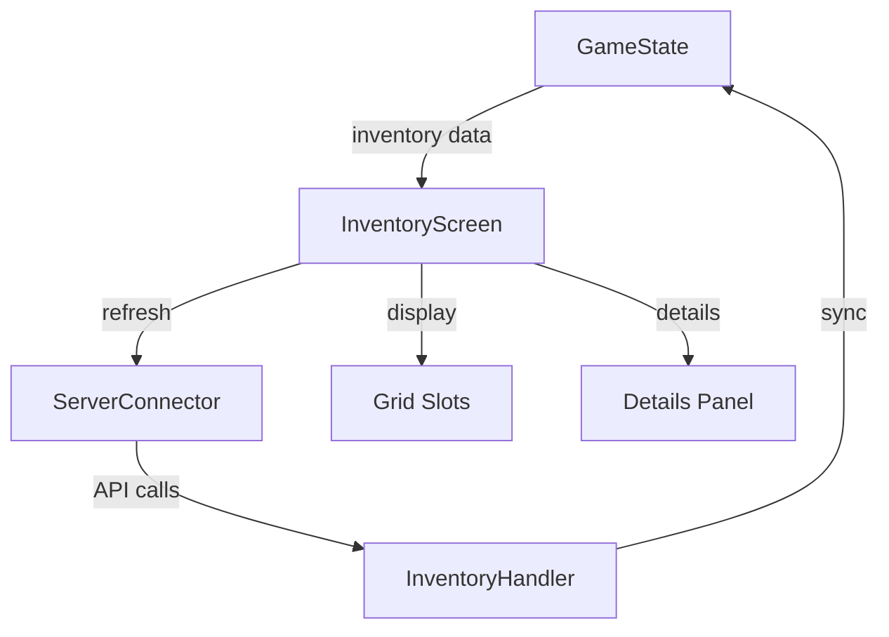
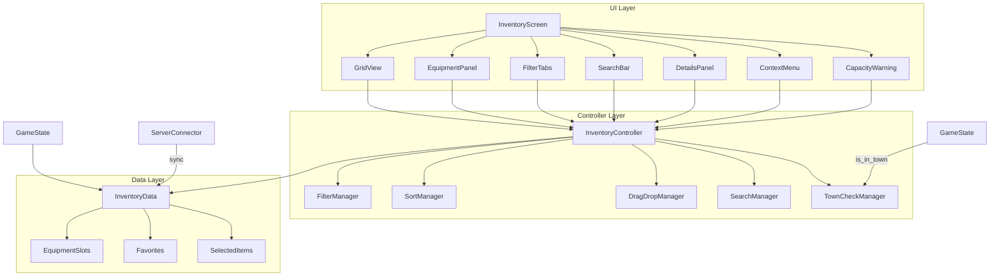

# Inventory Enhancement Plan - Textical Game

**Version:** 1.1  
**Date:** 2026-02-02  
**Status:** Draft - Pending Review

---

## Current State Analysis

### Existing Inventory System
- **Grid-based slots:** 20 slots (5x4) default
- **Item display:** Emoji-based icons with rarity colors
- **Quantity support:** Stacking for stackable items
- **UI Components:** 
  - Header dengan capacity bar
  - Grid container untuk slots
  - Details panel untuk item info
- **Network integration:** ServerConnector untuk fetch inventory

### Architecture Diagram (Current)


---

## Proposed Enhancements

### Phase 1: Core Improvements (Priority: High)

| # | Feature | Description | Complexity |
|---|---------|-------------|------------|
| 1 | **Category Filtering** | Tab-based filtering (Materials, Equipment, Consumables, Quest) | Medium |
| 2 | **Search Functionality** | Real-time item search by name | Low |
| 3 | **Sort Options** | Sort by Name, Rarity, Quantity, Category | Low |
| 4 | **Item Tooltips** | Hover-based tooltips dengan quick stats | Low |
| 5 | **Drag & Drop** | Reorganize items dengan drag-drop | Medium |
| 6 | **Stack Splitting** | Split stacks dengan drag quantity selector | Medium |

### Phase 2: Equipment System (Priority: High)

| # | Feature | Description | Complexity |
|---|---------|-------------|------------|
| 7 | **Equipment Panel** | Separate equipment slots (Head, Body, Weapon, Accessory) | High |
| 8 | **Quick Equip/Unequip** | Context menu untuk equip/unequip | Medium |
| 9 | **Stats Preview** | Show stat changes saat hovering equipped items | Medium |
| 10 | **Item Comparison** | Compare equipped vs inventory items | Medium |

### Phase 3: Quality of Life & Information (Priority: Medium)

| # | Feature | Description | Complexity |
|---|---------|-------------|------------|
| 11 | **Bulk Actions** | Multi-select untuk drop/sell/move | Medium |
| 12 | **Favorite Items** | Pin/lock items dari accidental deletion | Low |
| 13 | **Item Hotkeys** | Assign keyboard shortcuts ke consumables | Low |
| 14 | **Auto-sort** | One-click inventory organization | Low |
| 15 | **Capacity Warnings** | Visual alerts untuk low inventory space | Low |
| 16 | **Item Quality/Level Indicator** | Show item ilevel/quality di tooltip | Low |
| 17 | **Vendor Price Preview** | Show sell value sebelum sell | Low |
| 18 | **Quick Stack** | Auto-stack similar items dengan one-click | Low |
| 19 | **Loot Filter Rules** | Auto-pickup settings berdasarkan rarity/type | Medium |
| 20 | **Auto-Sort on Pickup** | Auto-organize saat items ditambahkan | Medium |
| 21 | **Item Drop Confirmation** | Dialog konfirmasi saat drop/delete | Low |
| 22 | **Consumable Cooldown Display** | Show cooldown pada consumable items | Low |
| 23 | **Item Usage Requirements** | Show stat requirements di tooltip | Low |
| 24 | **Set Bonus Preview** | Show set bonuses saat hovering items | Medium |

### Phase 4: Advanced Features (Priority: Medium) - Town Only

> **Note:** These features are only available when player is in Town (Region 1)

| # | Feature | Description | Complexity | Town Only |
|---|---------|-------------|------------|-----------|
| 25 | **Item Sets/Collections** | Track set completion & bonuses | High | ✅ |
| 26 | **Crafting Integration** | Quick-craft dari inventory materials | Medium | ✅ |
| 27 | **Market Integration** | Quick-sell ke market dari inventory | Medium | ✅ |
| 28 | **Bank/Storage Access** | Deposit/withdraw dari inventory | High | ✅ |

### Phase 5: Technical & Visual (Priority: Low)

| # | Feature | Description | Complexity |
|---|---------|-------------|------------|
| 29 | **Virtualized Grid** | Lazy loading untuk performance | Medium |
| 30 | **Event System** | Centralized inventory events | Medium |
| 31 | **Rarity Glow Effects** | Enhanced glow effects berdasarkan rarity | Low |
| 32 | **Item Particle Effects** | VFX untuk item actions | Low |

### Removed Features (per user request)
- ~~Item History/Last Used~~
- ~~Quick Use Menu~~
- ~~Inventory Caching~~
- ~~Save/Load Presets~~
- ~~Sound Effects~~

---

## Proposed Architecture (Enhanced)


---

## Town-Only Feature Implementation

### Location Check System
```gdscript
# Di GameState.gd - sudah ada method is_in_town()
func is_in_town():
    return current_user and current_user.currentRegion == 1

# Usage dalam InventoryScreen
func _on_craft_button_pressed():
    if GameState.is_in_town():
        _open_crafting_screen()
    else:
        _show_town_only_warning("Crafting is only available in Town")
```

### UI Indicators
- Add "Town Only" badge pada Crafting/Market/Bank buttons
- Disable dan grayed-out saat player di luar kota
- Show tooltip: "Return to Town to access this feature"

---

## Implementation Priority Recommendations

### Quick Wins (Week 1)
1. **Search Functionality** - High impact, low effort
2. **Sort Options** - High impact, low effort  
3. **Item Tooltips** - Improves UX significantly
4. **Capacity Warnings** - Visual improvement

### Core Features (Week 2-3)
1. **Category Filtering** - Essential for organization
2. **Drag & Drop** - Expected inventory behavior
3. **Stack Splitting** - Common player request
4. **Equipment Panel** - Major feature addition

### Advanced Features (Week 4+)
1. **Equipment System** - Stats, comparison, preview
2. **Town-Only Features** - Crafting, Market, Bank with location check
3. **Bulk Actions** - Quality of life improvement
4. **Item Sets/Collections** - Long-term engagement

---

## Technical Considerations

### Performance Optimization
- Implement **virtual scrolling** for large inventories (>100 slots)
- Use **lazy loading** untuk item icons
- Cache frequently accessed data in **GameState**

### Network Optimization
- Batch inventory updates during idle time
- Implement **optimistic UI updates** for instant feedback
- Use **delta syncing** instead of full inventory reload

### Data Structure Changes
```gdscript
# Proposed enhanced inventory item structure
class ItemData:
    var id: int
    var template_id: int
    var quantity: int
    var is_favorite: bool = false
    var is_equipped: bool = false
    var slot_position: int = -1
    var custom_name: String = ""
    var enchantments: Array = []
```

### Town Check Integration
```gdscript
# Helper function untuk town-only features
func check_town_access(feature_name: String) -> bool:
    if GameState.is_in_town():
        return true
    _show_notification(feature_name + " is only available in Town")
    return false
```

---

## File Changes Required

### New Files to Create
| File | Purpose |
|------|---------|
| `client/src/ui/inventory/InventorySlot.gd` | Reusable slot component dengan drag-drop |
| `client/src/ui/inventory/EquipmentPanel.gd` | Equipment slot UI (Head, Body, Weapon, Accessory) |
| `client/src/ui/inventory/ItemTooltip.gd` | Hover tooltip system |
| `client/src/ui/inventory/InventoryFilter.gd` | Category filtering dengan tabs |
| `client/src/ui/inventory/InventorySearch.gd` | Search functionality |
| `client/src/ui/inventory/DragDropHandler.gd` | Drag-drop system dengan stack splitting |
| `client/src/inventory/InventoryEvents.gd` | Event bus untuk inventory |
| `client/src/ui/inventory/TownOnlyGuard.gd` | Town-only feature guard |
| `client/src/data/ItemSets.json` | Item set definitions |

### Files to Modify
| File | Changes |
|------|---------|
| `client/src/ui/InventoryScreen.gd` | Add filtering, search, drag-drop, town-only checks |
| `client/src/ui/InventoryScreen.tscn` | Add equipment panel, filter tabs, search bar, capacity warning |
| `client/src/autoload/game_state.gd` | Add equipment slots, favorites, is_in_town() usage |
| `client/src/network/InventoryHandler.gd` | Add equipment sync, bulk operations |

---

## Testing Requirements

### Unit Tests
- Inventory CRUD operations
- Sorting algorithm correctness
- Filter accuracy
- Drag-drop state management
- Town-only guard functionality

### Integration Tests
- Server sync after modifications
- Equipment stat calculations
- Crafting material consumption (town-only)
- Market sell integration (town-only)

### UX Tests
- Drag-drop responsiveness
- Tooltip positioning
- Filter/sort performance with large inventories
- Mobile touch support
- Town-only warning display

---

## Open Questions for Discussion

1. **Should there be a "trash" confirm dialog?** (Prevent accidental deletion)
2. **How many equipment slots?** (Head, Body, Weapon, Accessory - 4 slots)
3. **Should item comparison be automatic or manual?** (Toggle option)
4. **Should there be a "mark all as junk" feature?** (For bulk selling)
5. **Should rare items have special visual indicators?** (Beyond current glow)

---

## Next Steps

1. [ ] Review dan approve plan ini
2. [ ] Select Phase 1 features untuk implementation
3. [ ] Create detailed implementation specs untuk selected features
4. [ ] Begin implementation in Code mode
