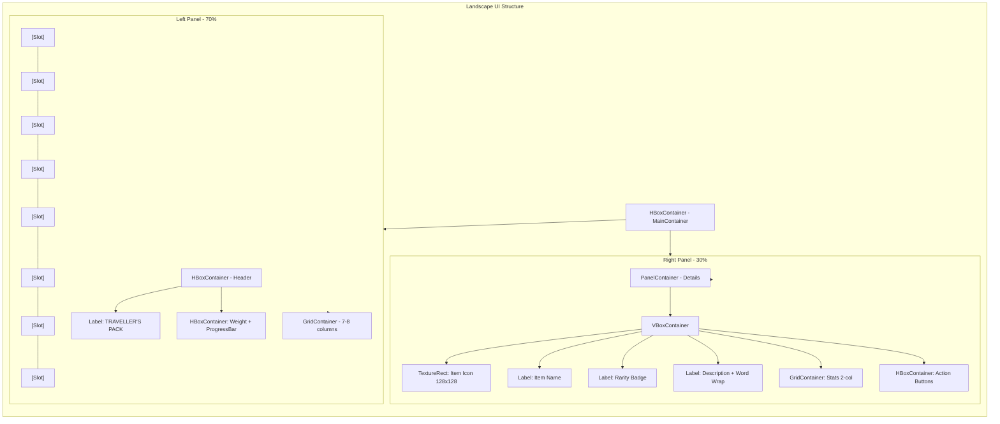

# Saran UI Landscape untuk InventoryScreen

## Analisis Layout Saat Ini (Portrait)

**Struktur saat ini:**
- `VBoxContainer` utama dengan 3 section:
  1. **Header**: Title "TRAVELLER'S PACK" + Weight bar (0/20)
  2. **GridFrame**: 5 kolom × 4 baris = 20 slot
  3. **Details**: Panel informasi item di bagian bawah

**Masalah dengan layout portrait untuk landscape:**
1. Ruang horizontal terbuang sia-sia
2. Details panel mengambil ruang vertikal yang berharga
3. Grid terbatas pada 5 kolom saja
4. User harus scroll untuk melihat semua item

---

## Rekomendasi Layout Landscape

### Struktur Layout Baru (2-Kolom)

```
┌─────────────────────────────────────────────────────────────┐
│  TopHUD + TaskListHUD                                       │
├─────────────────────────────────────────────────────────────┤
│  ┌──────────────────────┐  ┌──────────────────────────────┐ │
│  │                      │  │  DETAILS PANEL               │ │
│  │   INVENTORY GRID     │  │  ┌────────────────────────┐   │ │
│  │   (7-8 columns)      │  │  │  Item Icon + Name      │   │ │
│  │                      │  │  ├────────────────────────┤   │ │
│  │  [Slot][Slot][Slot]  │  │  │  Item Description      │   │ │
│  │  [Slot][Slot][Slot]  │  │  ├────────────────────────┤   │ │
│  │  [Slot][Slot][Slot]  │  │  │  Stats & Properties    │   │ │
│  │  [Slot][Slot][Slot]  │  │  ├────────────────────────┤   │ │
│  │  [Slot][Slot][Slot]  │  │  │  Action Buttons        │   │ │
│  │                      │  │  │  - Use/Equip           │   │ │
│  │                      │  │  │  - Drop/Sell           │   │ │
│  │                      │  │  │  - Split         │   │ Stack │
│  └──────────────────────┘  └──────────────────────────────┘ │
├─────────────────────────────────────────────────────────────┤
│  BottomHUD                                                  │
└─────────────────────────────────────────────────────────────┘
```

### Perubahan Utama

#### 1. Container Layout
- **Portrait saat ini**: `VBoxContainer` dengan 3 children
- **Landscape baru**: `HBoxContainer` utama dengan 2 children:
  - Left Panel (70% width): Inventory Grid
  - Right Panel (30% width): Details Panel

#### 2. Inventory Grid Enhancements
- **Kolom**: Tambah dari 5 → **7-8 kolom**
- **Baris**: 4-5 baris tergantung layar
- **Slot size**: `90×90` (sedikit lebih kecil untuk muat lebih banyak)
- **Spacing**: `h_separation: 15`, `v_separation: 15`

#### 3. Details Panel (Samping Kanan)
- **Ukuran**: Fixed width `350-400px` atau 30% dari layar
- **Konten baru**:
  - **Item Icon**: Besar di tengah (128×128)
  - **Item Name**: Di bawah icon, lebih besar
  - **Rarity Badge**: Indikator warna rarity di pojok
  - **Description**: Text wrap dengan font lebih besar
  - **Stats Grid**: 2 kolom untuk stats (+5 / +10 / etc.)
  - **Action Buttons**: "Use", "Equip", "Drop", "Examine"
  - **Sell Value**: Jika applicable
  - **Weight Impact**: Berapa berat jika digunakan

#### 4. Header Baris
- Pindah ke atas grid (tidak lagi VBox)
- Horizontal layout: Title di kiri, Capacity di kanan
- Capacity bar: Horizontal, tidak vertical

#### 5. Visual Improvements

**StyleBox baru:**
```gdscript
# Ghost Frame dengan corners lebih halus
corner_radius_top_left = 16
corner_radius_top_right = 16
corner_radius_bottom_right = 16
corner_radius_bottom_left = 16

# Details panel dengan glass effect
bg_color = Color(0, 0, 0, 0.5)
border_width_left = 2
border_color = Color(1, 0.8, 0.4, 0.3)
```

**Glow effects untuk item rarity:**
- COMMON: Tidak ada glow
- RARE: Border emas tipis
- EPIC: Glow ungu lembut
- LEGENDARY: Pulsing glow oranye

### Implementasi Steps

```markdown
1. Ubah root node dari VBoxContainer → HBoxContainer
2. Rename "Main" menjadi "MainContainer"
3. Split "Main" menjadi "LeftPanel" dan "RightPanel"
4. Pindahkan GridFrame ke LeftPanel (70% size)
5. Buat RightPanel baru dengan Details content
6. Update script untuk referensi node baru
7. Tambahkan Action buttons di Details panel
8. Adjust slot size dan grid columns (7-8)
9. Tambahkan rarity indicators
10. Test responsiveness untuk berbagai aspect ratios
```

### Mermaid Diagram - Proposed Layout



### Responsive Behavior

| Aspect Ratio | Columns | Notes |
|--------------|---------|-------|
| 16:9 | 8 | Optimal untuk landscape |
| 16:10 | 8 | Sedikit lebih tinggi |
| 4:3 | 6 | Tablet landscape |
| 3:2 | 7 | Phablet landscape |

### Pertanyaan untuk User

1. **Preferred slot size**: 90×90 atau 100×100?
2. **Details panel**: Fixed width atau percentage-based?
3. **Action buttons**: Horizontal atau grid layout?
4. **Should keep portrait support** atau fully switch to landscape?
5. **Animations**: Add hover transitions pada slot?

---

## Summary

**Landscape advantages:**
- Lebih banyak slot visible (35-40 vs 20)
- Details panel tidak consume vertical space
- Lebih natural untuk desktop/tablet
- Visual hierarchy lebih jelas (grid vs info)

**Potential drawbacks:**
- Perlu hit detection untuk HBoxContainer resize
- Lebih kompleks untuk maintain
- Portrait users mungkin terganggu
