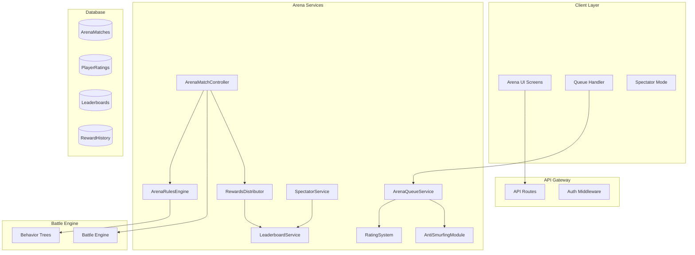
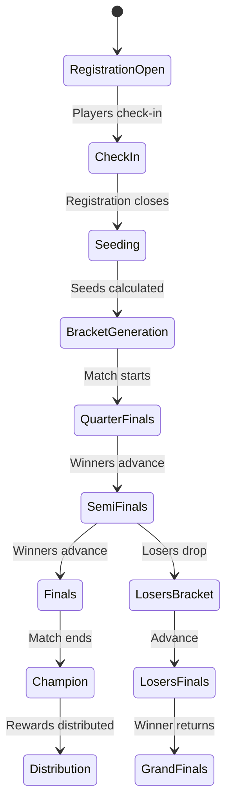
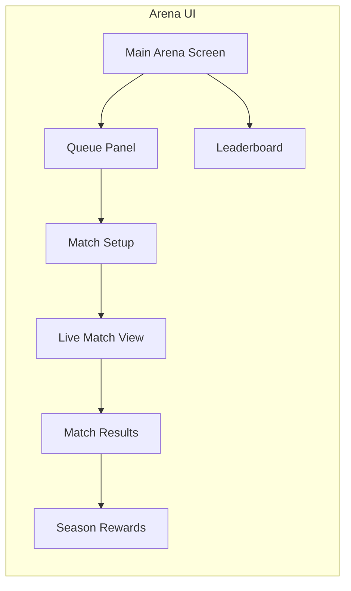

# ⚔️ PvP Arena/Ranked Matchmaking System - Architecture Design

## 📋 Executive Summary

Feature PvP Arena System memungkinkan pemain bertarung secara kompetitif dengan sistem rating berbasis ELO. Sistem ini mendukung multiple game modes (1v1, 2v2, Free-For-All), seasonal rankings, rewards, dan spectator mode.

---

## 🏗️ System Architecture



---

## 🎮 Game Modes

| Mode | Players | Team Size | Rating Type | Entry Requirements | Tournament Support |
|------|---------|-----------|-------------|-------------------|-------------------|
| **1v1 Duel** | 2 | Solo | 1v1 ELO | Level 30+ | ✓ Single/Double Elim |
| **2v2 Skirmish** | 4 | 2v2 | Team ELO | Level 40+, 2 players | ✓ Team Brackets |
| **Free-For-All** | 4-8 | Solo | FFA Points | Level 35+ | ✗ -
| **Tournament** | 8-32 | Solo/Team | Tournament RP | Level 50+, Entry Fee | ✓ Full Bracket System |

---

## 🏆 Tournament System

### Tournament Types

| Type | Participants | Bracket Type | Entry Fee | Duration |
|------|--------------|--------------|-----------|----------|
| **Daily Cup** | 8 | Single Elim | 50 Gems | 30-45 min |
| **Weekly Championship** | 16 | Double Elim | 100 Gems | 2-3 hours |
| **Monthly Grand Slam** | 32 | Single Elim | 200 Gems | 4-6 hours |
| **Special Event** | 16-64 | Custom | Variable | Custom |

### Bracket Structure

```
Quarter Finals          Semi Finals           Finals           Champion
┌─────────────┐        ┌──────────┐        ┌─────────┐
│  Match A1   │ ─────► │ Match S1 │ ─────► │ Match   │ ─────► 🏆
│ P1 vs P8    │        │ A1 vs A2 │        │   F1    │
└─────────────┘        └──────────┘        │  W-S1   │
                                          │ vs W-S2 │
┌─────────────┐        ┌──────────┐        └─────────┘
│  Match A2   │ ─────► │ Match S2 │ ─────► │ Match   │
│ P4 vs P5    │        │ A3 vs A4 │        │   F2    │
└─────────────┘        └──────────┘        │  W-S3   │
                                          │ vs W-S4 │
┌─────────────┐        ┌──────────┘        └─────────┘
│  Match A3   │ ─────► │ Match S3 │
│ P2 vs P7    │        │ A5 vs A6 │
└─────────────┘        └──────────┘

┌─────────────┐        ┌──────────┐
│  Match A4   │ ─────► │ Match S4 │
│ P3 vs P6    │        │ A7 vs A8 │
└─────────────┘        └──────────┘

Losers Bracket (Double Elimination):
┌──────────┐        ┌──────────┐        ┌──────────┐
│ Match L1 │ ─────► │ Match L3 │ ─────► │ Match LF │
│ A2L vs A1L│       │ L1 vs L2 │        │ S1L vs S2L│
└──────────┘        └──────────┘        └──────────┘
```

### Tournament Phases



### Database Schema - Tournament

```prisma
// Tournament Definition
model Tournament {
    id              String   @id @default(uuid())
    name            String
    type            TournamentType
    
    // Structure
    maxParticipants Int
    currentParticipants Int @default(0)
    bracketType     BracketType
    
    // Scheduling
    registrationStart DateTime
    registrationEnd   DateTime
    startDate       DateTime
    endDate         DateTime
    
    // Entry
    entryFee        Int      // gems
    minLevel        Int      @default(50)
    
    // Rewards
    prizePool       Json     // { 1: { gems: 1000, title: "Champion" }, 2: {...} }
    participationReward Int
    
    // Status
    status          TournamentStatus @default(REGISTRATION)
    winnerId        String?
    
    // Relationships
    matches         TournamentMatch[]
    participants   TournamentParticipant[]
    
    @@index([status, startDate])
}

// Tournament Participant
model TournamentParticipant {
    id              String   @id @default(uuid())
    tournamentId    String
    playerId        String
    
    // Seed
    seed            Int
    Elo             Int      // Rating at registration
    
    // Status
    status          ParticipantStatus @default(REGISTERED)
    checkedIn       Boolean  @default(false)
    
    // Progress
    currentRound    Int      @default(0)
    wins            Int      @default(0)
    losses          Int      @default(0)
    isEliminated    Boolean  @default(false)
    
    // Bracket Position
    bracketPosition Int
    
    createdAt       DateTime @default(now())
    
    @@unique([tournamentId, playerId])
}

// Tournament Match
model TournamentMatch {
    id              String   @id @default(uuid())
    tournamentId    String
    
    // Match Info
    round           Int      // 1 = QF, 2 = SF, 3 = Finals
    matchNumber     Int      // Position in round
    bracketType     BracketType @default(WINNERS)
    
    // Players
    playerAId       String?
    playerBId       String?
    winnerId        String?
    
    // Score
    scoreA          Int      @default(0)
    scoreB          Int      @default(0)
    
    // Timing
    scheduledAt     DateTime
    startedAt       DateTime?
    completedAt     DateTime?
    
    // Arena Link
    arenaMatchId    String?
    
    // Next Match (for bracket progression)
    nextMatchId     String?
    loserNextMatchId String?
}

// Tournament Bracket State
model TournamentBracket {
    id              String   @id @default(uuid())
    tournamentId    String
    
    // Bracket Data (JSON)
    bracketData     Json     // Full bracket structure
    
    // Current State
    currentRound    Int
    activeMatches   Json     // Currently playing matches
    
    updatedAt       DateTime @updatedAt
}
```

### Tournament Services

```typescript
class TournamentService {
    // Registration
    async openRegistration(tournamentId: string): Promise<void>;
    async registerPlayer(tournamentId: string, playerId: string): Promise<void>;
    async unregisterPlayer(tournamentId: string, playerId: string): Promise<void>;
    async processCheckIn(tournamentId: string, playerId: string): Promise<void>;
    
    // Seeding
    async calculateSeeds(tournamentId: string): Promise<void>;
    private generateSeedList(participants: Participant[]): SeedResult[];
    
    // Bracket Generation
    async generateBracket(tournamentId: string): Promise<void>;
    private createBracketStructure(participants: Participant[], type: BracketType): BracketData;
    private createDoubleElimBracket(participants: Participant[]): BracketData;
    
    // Match Management
    async startMatch(matchId: string, arenaMatchId: string): Promise<void>;
    async completeMatch(matchId: string, winnerId: string, score: Score): Promise<void>;
    private advanceWinner(match: TournamentMatch, winnerId: string): Promise<void>;
    private advanceLoser(match: TournamentMatch, loserId: string): Promise<void>;
    
    // Auto-Advance (timeout)
    async handleMatchTimeout(matchId: string): Promise<void>;
    private autoAdvanceByDefault(match: TournamentMatch): Promise<void>;
    
    // Tournament Completion
    async completeTournament(tournamentId: string): Promise<void>;
    async distributeRewards(tournamentId: string): Promise<void>;
}

class BracketGenerator {
    // Single Elimination
    generateSingleElimination(participants: Participant[], seeds: number[]): BracketData;
    private calculateRoundMatchups(round: number, bracket: BracketData): void;
    
    // Double Elimination
    generateDoubleElimination(participants: Participant[], seeds: number[]): BracketData;
    private generateLosersBracket(winnersBracket: BracketData): BracketData;
    
    // Bracket Balancing
    balanceBracket(bracket: BracketData): BracketData;
    private redistributeSeeds(bracket: BracketData): void;
}
```

### Tournament Rewards

| Placement | Daily Cup | Weekly | Monthly | Title |
|-----------|-----------|--------|---------|-------|
| 1st | 500 Gems | 2000 Gems | 5000 Gems | "Cup Champion" |
| 2nd | 250 Gems | 1000 Gems | 2500 Gems | "Runner Up" |
| 3rd | 100 Gems | 500 Gems | 1000 Gems | "Top 3" |
| 4th | 50 Gems | 250 Gems | 500 Gems | "Top 4" |
| 5-8 | 25 Gems | 100 Gems | 250 Gems | "Quarter Finalist" |
| Participation | 10 Gems | 25 Gems | 50 Gems | - |

---

## 📊 Rating System (ELO)

### Base ELO Formula
```
ExpectedScore = 1 / (1 + 10^((OpponentRating - PlayerRating) / 400))

NewRating = PlayerRating + K * (ActualScore - ExpectedScore)

Where:
- K = 32 (max adjustment per match)
- ActualScore = 1 (win), 0.5 (draw), 0 (loss)
```

### Rank Tiers

| Rank | ELO Range | Title | Season Rewards |
|------|-----------|-------|----------------|
| Bronze V | 0-799 | Novice | 100 Gems |
| Bronze IV | 800-999 | Fighter | 150 Gems |
| Bronze III | 1000-1199 | Warrior | 200 Gems |
| Bronze II | 1200-1399 | Gladiator | 250 Gems |
| Bronze I | 1400-1599 | Champion | 300 Gems |
| Silver IV | 1600-1799 | Elite | 400 Gems |
| Silver III | 1800-1999 | Veteran | 500 Gems |
| Silver II | 2000-2199 | Hero | 600 Gems |
| Silver I | 2200-2399 | Legend | 750 Gems |
| Gold IV | 2400-2599 | Mythic | 1000 Gems |
| Gold III | 2600-2799 | Demigod | 1250 Gems |
| Gold II | 2800-2999 | Celestial | 1500 Gems |
| Gold I | 3000+ | Divine | 2000 Gems |

---

## 🗄️ Database Schema (Prisma)

```prisma
// Arena Match Record
model ArenaMatch {
    id              String   @id @default(uuid())
    matchCode       String   @unique
    gameMode        GameMode
    status          MatchStatus @default(QUEUED)
    
    // Players
    playerIds       String[]
    teamAIds        String[]
    teamBIds        String[]
    
    // Results
    winnerId        String?
    winCondition    WinCondition?
    
    // Ratings
    ratingChanges   Json     // { playerId: { before, after, delta } }
    
    // Timing
    queuedAt        DateTime
    startedAt       DateTime?
    endedAt         DateTime?
    duration        Int?     // seconds
    
    // Metadata
    seasonId        String
    isRanked        Boolean  @default(true)
    
    @@index([seasonId, gameMode])
}

// Player Arena Rating
model ArenaRating {
    playerId        String   @id
    seasonId        String
    
    // 1v1 Rating
    soloRating      Int      @default(1000)
    soloWins        Int      @default(0)
    soloLosses      Int      @default(0)
    soloStreak      Int      @default(0)
    
    // Team Rating  
    teamRating      Int      @default(1000)
    teamWins        Int      @default(0)
    teamLosses      Int      @default(0)
    
    // FFA
    ffaPoints       Int      @default(0)
    ffaWins         Int      @default(0)
    
    // Current Rank
    currentRank     String   @default("Bronze V")
    highestRank     String   @default("Bronze V")
    division        Int      @default(5)
    
    // Season Progress
    seasonWins      Int      @default(0)
    seasonMatches   Int      @default(0)
    
    updatedAt       DateTime @updatedAt
    
    @@unique([playerId, seasonId])
}

// Arena Season
model ArenaSeason {
    id              String   @id @default(uuid())
    seasonNumber    Int
    name            String
    startDate       DateTime
    endDate         DateTime
    
    // Rewards
    topRewards      Json     // { rank: { gems, title, items } }
    participation   Int      // gems for participation
    
    // Status
    isActive        Boolean  @default(false)
    isComplete      Boolean  @default(false)
    
    @@unique([seasonNumber])
}

// Leaderboard Entry
model ArenaLeaderboard {
    id              String   @id @default(uuid())
    playerId        String
    seasonId        String
    gameMode        GameMode
    
    rank            Int
    rating          Int
    wins            Int
    losses          Int
    winRate         Float
    
    // Streaks
    currentStreak   Int      @default(0)
    maxStreak       Int      @default(0)
    
    // Spectator
    spectatedCount  Int      @default(0)
    
    updatedAt       DateTime @updatedAt
    
    @@unique([playerId, seasonId, gameMode])
}
```

---

## 🔧 Core Services

### 1. ArenaQueueService

```typescript
class ArenaQueueService {
    // Queue Management
    private queues: Map<GameMode, PlayerQueue>;
    
    async addToQueue(playerId: string, mode: GameMode): Promise<void>;
    async removeFromQueue(playerId: string): Promise<void>;
    async getQueueStatus(mode: GameMode): QueueStatus;
    
    // Matchmaking Logic
    async findMatch(playerId: string, mode: GameMode): Promise<MatchResult>;
    private calculateMatchmakingRating(player: Player): number;
    private findOptimalOpponent(queuedPlayers: Player[]): Player[];
    
    // Party Queue Support
    async addPartyToQueue(partyId: string, mode: GameMode): Promise<void>;
    private validatePartySize(mode: GameMode): boolean;
}
```

### 2. RatingSystem

```typescript
class RatingSystem {
    // ELO Calculations
    calculateExpectedScore(playerRating: number, opponentRating: number): number;
    calculateNewRating(playerRating: number, kFactor: number, score: number, expected: number): number;
    
    // Rank Management
    getRankFromRating(rating: number): RankInfo;
    getNextRank(currentRank: RankInfo): RankInfo | null;
    
    // Streak Bonuses
    calculateStreakBonus(streak: number): number; // Max +8 per match at 10+ streak
    
    // Division Progress
    getDivisionProgress(rating: number, rank: Rank): DivisionProgress;
}
```

### 3. ArenaMatchController

```typescript
class ArenaMatchController {
    // Match Lifecycle
    async createMatch(players: Player[], mode: GameMode): Promise<ArenaMatch>;
    async startMatch(matchId: string): Promise<void>;
    async endMatch(matchId: string, result: MatchResult): Promise<void>;
    
    // Timeout Handling
    async handlePlayerTimeout(playerId: string): Promise<void>;
    async handleDisconnect(playerId: string): Promise<void>;
    
    // Match Integrity
    validateMatchEnd(match: ArenaMatch): boolean;
    detectSuspiciousActivity(match: ArenaMatch): SuspicionReport;
}
```

### 4. ArenaRulesEngine

```typescript
class ArenaRulesEngine {
    // Mode-Specific Rules
    private rules: Map<GameMode, ArenaRules>;
    
    getRulesForMode(mode: GameMode): ArenaRules;
    validateMatchConfiguration(players: Player[], mode: GameMode): ValidationResult;
    
    // Win Conditions
    determineWinCondition(match: ArenaMatch): WinCondition;
    checkElimination(match: ArenaMatch): PlayerEliminationResult;
    checkObjectiveComplete(match: ArenaMatch): ObjectiveResult;
}
```

### 5. RewardsDistributor

```typescript
class RewardsDistributor {
    // Match Rewards
    async distributeMatchRewards(match: ArenaMatch): Promise<RewardDistribution>;
    private calculateBaseRewards(winner: boolean, streak: int): Rewards;
    
    // Rank Rewards
    async distributeSeasonRewards(seasonId: string): Promise<void>;
    private calculateSeasonRewards(rank: Rank, participation: int): SeasonRewards;
    
    // Achievement Unlocks
    async checkAchievements(playerId: string, match: ArenaMatch): Achievement[];
}
```

### 6. AntiSmurfingModule

```typescript
class AntiSmurfingModule {
    // Smurf Detection
    detectSmurf(player: Player): SmurfProbability;
    private analyzeBehaviorPattern(player: Player): BehaviorPattern;
    private checkWinRateAnomaly(player: Player): boolean;
    
    // Matchmaking Restrictions
    applySmurfPenalties(player: Player): MatchmakingRestrictions;
    private adjustQueuePriority(player: Player): number;
    
    // Account Linking
    linkAccounts(playerId: string, hwId: string): void;
    checkMultiAccounting(playerId: string): AccountLink[];
}
```

### 7. SpectatorService

```typescript
class SpectatorService {
    // Spectator Management
    async startSpectating(spectatorId: string, matchId: string): Promise<void>;
    async stopSpectating(spectatorId: string): Promise<void>;
    getActiveSpectators(matchId: string): string[];
    
    // Live Feed
    broadcastMatchUpdate(matchId: string, update: MatchUpdate): void;
    getSpectatorView(matchId: string): SpectatorView;
    
    // Chat
    allowSpectatorChat(spectatorId: string): boolean;
}
```

---

## 🎨 UI Components



### UI Screens Description

| Screen | Components | Function |
|--------|-----------|----------|
| **Main Arena** | Mode selector, Season info, Daily missions | Entry point to arena features |
| **Queue Panel** | Timer, Opponent hint, Cancel button | Shows queue status |
| **Match Setup** | Team composition, Hero selection, Pre-match chat | Finalize match settings |
| **Live Match** | Health bars, Action feed, Spectator count, Emotes | In-game experience |
| **Match Results** | XP gained, Rating change, MVP, Rewards preview | Post-match summary |
| **Leaderboard** | Global rank, Filter by mode, Season top 10 | Competitive display |
| **Season Rewards** | Current progress, Tier unlocks, Claim button | Seasonal progression |
| **Tournament Hub** | Active tournaments, Registration, Bracket view | Tournament entry point |
| **Tournament Bracket** | Visual bracket, Match info, Player cards | Track tournament progress |
| **Tournament Lobby** | Player list, Countdown, Team assignment | Pre-tournament waiting |
| **Tournament Results** | Final standings, Rewards, Title unlocks | Tournament completion |

---

## 🔌 API Endpoints

### Matchmaking
```
POST   /api/arena/queue           - Join queue
DELETE /api/arena/queue           - Leave queue
GET    /api/arena/queue/status    - Queue status
GET    /api/arena/matchmaking     - Current match info
```

### Matches
```
GET    /api/arena/matches         - Match history
GET    /api/arena/matches/:id     - Match details
POST   /api/arena/matches/ready   - Ready check
GET    /api/arena/matches/replay  - Watch replay
```

### Ratings & Leaderboards
```
GET    /api/arena/rating          - Current rating
GET    /api/arena/leaderboard     - Global rankings
GET    /api/arena/season          - Season info
GET    /api/arena/rewards         - Available rewards
```

### Spectator
```
GET    /api/arena/spectate/:id    - Spectate match
GET    /api/arena/spectate/list   - Live matches
POST   /api/arena/spectate/chat   - Spectator chat
```

### Tournament
```
GET    /api/tournaments           - List tournaments
GET    /api/tournaments/:id       - Tournament details
POST   /api/tournaments/:id/register   - Register for tournament
DELETE /api/tournaments/:id/register  - Unregister
POST   /api/tournaments/:id/checkin    - Check-in
GET    /api/tournaments/:id/bracket    - View bracket
GET    /api/tournaments/:id/matches    - Match schedule
GET    /api/tournaments/:id/standings  - Current standings
POST   /api/tournaments/create         - Create tournament (Admin)
```

---

## 🛡️ Security & Integrity

### Anti-Cheat Measures
1. **Server-Side Validation** - All actions validated on server
2. **Input Sanitization** - Prevent injection attacks
3. **Rate Limiting** - Prevent queue spam
4. **IP Tracking** - Detect multi-accounting
5. **Behavior Analysis** - Detect abnormal play patterns

### Match Integrity
1. **Disconnect Penalties** - Leaver penalty system
2. **AFK Detection** - Auto-forfeit for inactive players
3. **Replay System** - Record matches for review
4. **Report System** - Player reporting for misconduct

---

## 📈 Performance Considerations

- **Queue Processing**: Batch match creation every 500ms
- **Rating Updates**: Async processing to not block match flow
- **Leaderboard Caching**: Redis cache with 5-minute TTL
- **Spectator Optimization**: Delta compression for updates
- **Database Indexing**: Index on (seasonId, gameMode, rating)

---

## ✅ Implementation Phases

### Phase 1: Core Infrastructure
- [ ] Database schema setup
- [ ] ArenaQueueService basic implementation
- [ ] RatingSystem (ELO calculation)
- [ ] Basic API endpoints

### Phase 2: Match System
- [ ] ArenaMatchController
- [ ] ArenaRulesEngine
- [ ] Battle integration
- [ ] Match results processing

### Phase 3: Rewards & Progression
- [ ] RewardsDistributor
- [ ] LeaderboardService
- [ ] Season management
- [ ] Achievement integration

### Phase 4: Tournament System
- [ ] TournamentService core
- [ ] BracketGenerator (Single Elimination)
- [ ] Double Elimination bracket support
- [ ] Tournament registration & check-in
- [ ] Tournament match management
- [ ] Auto-advance system for timeouts
- [ ] Tournament rewards distribution
- [ ] Tournament UI screens
- [ ] Tournament API endpoints

### Phase 5: UI & Polish
- [ ] Arena UI screens
- [ ] SpectatorModeService
- [ ] Leaderboard UI
- [ ] Season rewards UI
- [ ] Tournament bracket visualization

### Phase 6: Anti-Abuse & Analytics
- [ ] AntiSmurfingModule
- [ ] Match replay system
- [ ] Analytics dashboard
- [ ] Player statistics
