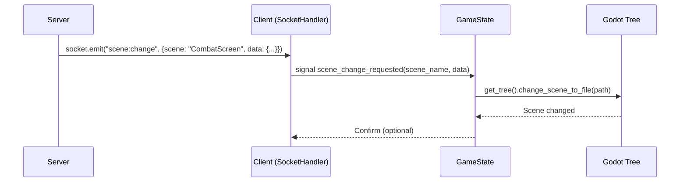

# Server-Forced Scene Change - Design Document

## Overview

Dokumen ini menjelaskan desain untuk fitur **Server-Forced Scene Change** yang memungkinkan server memaksa client Godot untuk berpindah scene. Fitur ini berguna untuk skenario seperti session expiration, combat initiation, teleport, dan anti-cheat.

---

## 1. Problem Statement

### Current State
- Scene change hanya bisa dipicu oleh **client-side actions** (button click, task completion)
- Server hanya bisa mengirim data via REST API atau socket events
- Tidak ada mekanisme untuk server menginisiasi scene change

### Use Cases

| # | Use Case | Trigger | Target Scene |
|---|----------|---------|--------------|
| 1 | Session Expired | Server detects expired token | LoginScreen |
| 2 | Force Logout | Multi-login detected | LoginScreen |
| 3 | Combat Start | Monster encounter detected | CombatScreen |
| 4 | Teleport | Quest/ability triggers | Region Scene |
| 5 | Anti-Cheat | Suspicious activity detected | LoginScreen |
| 6 | Maintenance | Server going down | MaintenanceScreen |

---

## 2. Architecture Design

### 2.1 High-Level Flow



### 2.2 Component Diagram

```mermaid
graph TB
    subgraph "Server"
        S[socketService.js]
        SR[socketRouter.js]
    end

    subgraph "Client"
        SH[SocketHandler.gd]
        GS[GameState.gd]
        LU[LoadingUtils.gd]
    end

    subgraph "Godot Engine"
        GT[get_tree()]
    end

    S -->|emitToUser| SH
    SH -->|scene_change_requested| GS
    GS -->|validate + change_scene| LU
    LU -->|change_scene_to_file| GT
```

---

## 3. API Design

### 3.1 Server Socket Event

**Event Name:** `scene:change`

**Direction:** Server → Client

**Payload:**
```javascript
{
    "scene": "COMBAT",        // Scene identifier (enum)
    "data": {                 // Optional data to pass
        "monsterId": 123,
        "encounterType": "AMBUSH"
    },
    "reason": "monster_encounter",  // Reason for logging
    "priority": "HIGH"        // HIGH: force immediately, NORMAL: queue
}
```

### 3.2 Scene Identifiers (Enum)

```javascript
const SCENE_IDENTIFIERS = {
    // Authentication
    LOGIN: "LOGIN",
    REGISTER: "REGISTER",
    
    // Main Game
    TOWN: "TOWN",
    WORLD_ATLAS: "WORLD_ATLAS",
    
    // Regions (by type)
    FOREST: "FOREST",
    DUNGEON: "DUNGEON",
    DESERT: "DESERT",
    // ... other regions
    
    // Combat
    COMBAT: "COMBAT",
    ARENA: "ARENA",
    
    // Social
    GUILD: "GUILD",
    CHAT: "CHAT",
    
    // Systems
    MARKET: "MARKET",
    TAVERN: "TAVERN",
    CRAFTING: "CRAFTING",
    INVENTORY: "INVENTORY",
    QUEST: "QUEST",
    
    // Special
    MAINTENANCE: "MAINTENANCE",
    ERROR: "ERROR"
};
```

---

## 4. Implementation Design

### 4.1 Server-Side Changes

#### 4.1.1 Add to socketService.js

```javascript
// server/src/services/socketService.js

/**
 * Force a client to change scene
 * @param {number} userId - Target user ID
 * @param {string} scene - Scene identifier
 * @param {object} data - Optional data to pass
 * @param {string} reason - Reason for logging
 */
forceSceneChange(userId, scene, data = {}, reason = "server_initiated") {
    return this.emitToUser(userId, "scene:change", {
        scene: scene,
        data: data,
        reason: reason,
        priority: "HIGH"
    });
}
```

#### 4.1.2 Usage Examples

```javascript
// Example 1: Session expired
socketService.forceSceneChange(userId, "LOGIN", {}, "session_expired");

// Example 2: Combat encounter
socketService.forceSceneChange(userId, "COMBAT", {
    monsterId: monster.id,
    encounterType: "AMBUSH"
}, "monster_encounter");

// Example 3: Teleport quest
socketService.forceSceneChange(userId, "DUNGEON", {
    regionId: 42,
    entranceId: 7
}, "quest_teleport");
```

### 4.2 Client-Side Changes

#### 4.2.1 SocketHandler.gd - Add Signal

```gdscript
# client/src/network/SocketHandler.gd

# Add new signal
signal scene_change_requested(scene_name, data)

# Add event handler in _on_data()
"scene:change": _on_scene_change(data)
```

```gdscript
func _on_scene_change(data: Dictionary):
    var scene_name = data.get("scene", "")
    var scene_data = data.get("data", {})
    var reason = data.get("reason", "server_initiated")
    
    print("[SOCKET] Scene change requested: ", scene_name, " reason: ", reason)
    scene_change_requested.emit(scene_name, scene_data)
```

#### 4.2.2 GameState.gd - Add Method

```gdscript
# client/src/autoload/game_state.gd

# Add signal
signal scene_forced(scene_name, data)

# Add method
func force_scene_change(scene_identifier: String, data: Dictionary = {}) -> bool:
    var scene_path = get_scene_path_from_identifier(scene_identifier)
    
    if scene_path == "":
        push_error("[STATE] Invalid scene identifier: " + scene_identifier)
        return false
    
    # Security: validate path
    if not LoadingUtils.validate_scene_path(scene_path):
        push_error("[STATE] Unauthorized scene change attempt: " + scene_path)
        return false
    
    print("[STATE] Force scene change to: ", scene_path)
    scene_forced.emit(scene_identifier, data)
    get_tree().change_scene_to_file(scene_path)
    return true

func get_scene_path_from_identifier(identifier: String) -> String:
    match identifier.to_upper():
        # Auth
        "LOGIN": return "res://src/ui/login/LoginScreen.tscn"
        
        # Main
        "TOWN": return "res://src/ui/TownScreen.tscn"
        "WORLD_ATLAS": return "res://src/ui/WorldAtlas.tscn"
        
        # Regions (delegate to existing get_region_scene)
        _: return get_region_scene(identifier)
```

#### 4.2.3 ServerConnector.gd - Route Signal

```gdscript
# client/src/autoload/server_connector.gd

func _ready():
    # ... existing code ...
    
    # Socket scene change routing
    socket.scene_change_requested.connect(_on_scene_change_requested)

func _on_scene_change_requested(scene_name: String, data: Dictionary):
    GameState.force_scene_change(scene_name, data)
```

### 4.3 Security

#### 4.3.1 Whitelist Validation

```gdscript
# client/src/ui/loading/LoadingUtils.gd

static func validate_scene_path(path: String) -> bool:
    var allowed_paths = [
        "res://src/ui/login/LoginScreen.tscn",
        "res://src/ui/TownScreen.tscn",
        "res://src/ui/WorldAtlas.tscn",
        "res://src/ui/CombatScreen.tscn",
        # ... full whitelist
    ]
    
    if path in allowed_paths:
        return true
    
    # Check region scenes
    if path.begins_with("res://src/ui/regions/"):
        return true
        
    return false
```

#### 4.3.2 Anti-Exploit

| Protection | Implementation |
|------------|----------------|
| Rate Limit | Max 1 scene change per 2 seconds |
| Path Validation | Whitelist only |
| Data Sanitization | Validate data before use |
| Logging | Log all forced scene changes |

---

## 5. Error Handling

### 5.1 Client Errors

| Error | Handling |
|-------|----------|
| Invalid scene identifier | Log error, stay on current scene |
| Scene file not found | Show error overlay, stay on current scene failed | Log security |
| Path validation warning, reject change |

### 5.2 Server Errors

| Error | Handling |
|-------|----------|
| User offline | Silently fail, no error |
| Invalid userId | Silently fail, no error |
| Socket not connected | Queue event for retry |

---

## 6. Backward Compatibility

- Add new functionality without breaking existing scene changes
- Existing button-triggered scenes continue to work
- Server can send `scene:change` to old clients (they'll just ignore it)
- Old servers work with new clients (no `scene:change` event sent)

---

## 7. Testing Plan

### 7.1 Unit Tests

| Test | Expected Result |
|------|-----------------|
| Valid scene identifier | Returns correct path |
| Invalid scene identifier | Returns empty string |
| Path validation | Correct whitelist check |

### 7.2 Integration Tests

| Test | Expected Result |
|------|-----------------|
| Server sends scene:change | Client changes scene |
| Session expired event | Returns to login |
| Combat encounter event | Opens combat screen |

### 7.3 Edge Cases

| Scenario | Expected |
|----------|----------|
| Scene change during combat | Queue or reject |
| Rapid scene changes | Rate limit |
| Invalid scene path | Stay on current |

---

## 8. Files to Modify

### 8.1 Server

| File | Changes |
|------|---------|
| `server/src/services/socketService.js` | Add `forceSceneChange()` method |

### 8.2 Client

| File | Changes |
|------|---------|
| `client/src/network/SocketHandler.gd` | Add signal + handler |
| `client/src/autoload/game_state.gd` | Add method + identifier mapping |
| `client/src/autoload/server_connector.gd` | Route signal |
| `client/src/ui/loading/LoadingUtils.gd` | Update whitelist |

---

## 9. Future Enhancements

| Enhancement | Description |
|-------------|-------------|
| Scene transition animation | Show loading screen during transition |
| Scene data persistence | Preserve UI state across scenes |
| Rollback mechanism | Return to previous scene on error |
| Multi-scene support | Support multiple active scenes |

---

## 10. Summary

| Aspect | Detail |
|--------|--------|
| **Mechanism** | Socket.io event + Godot signal |
| **Security** | Whitelist validation + rate limiting |
| **Backward Compatible** | Yes |
| **Use Cases** | Session, Combat, Teleport, Anti-Cheat |
| **Risk Level** | Low (with proper validation) |

---

## 11. Decision Required

- [x] Approve design
- [ ] Proceed to implementation
- [ ] Request modifications
- [ ] Reject feature