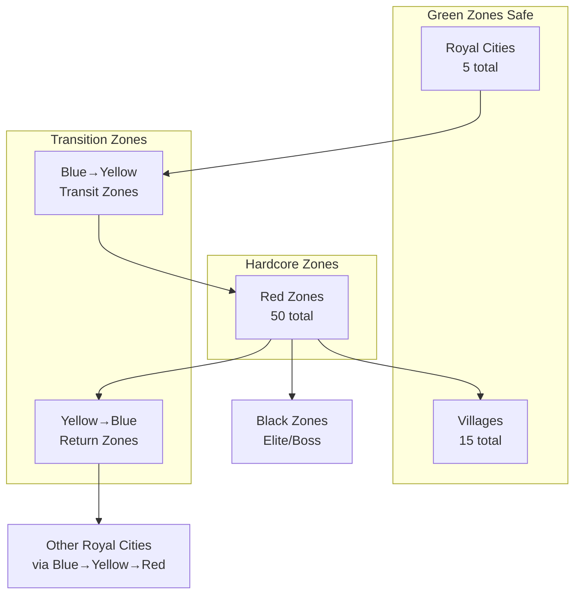

# Zone Population Plan

## Overview
Create a complete zone system with 50 Red Zones, 100 Yellow Zones, 200 Blue Zones, 5 Royal Cities, and 15 Villages following a progressive zone hierarchy.

## Black Zone Access
- All Black Zone entry points are ONLY through Red Zones
- Players must pass through Red Zone danger to reach Black Zone elite content
- Each Red Zone has 1-2 connections to Black Zones (Normal)
- This creates a clear progression: Green → Yellow → Red → Black → Boss

## Two-Tier Black Zone System

### Black Zone (Normal) - Entry Level
- **Count**: 15 zones
- **Purpose**: First taste of Black Zone danger
- **Monsters**: Strong monsters + Elite monsters
- **PvP**: Free-for-all
- **Death**: All units die, main unit respawns naked
- **Connection**: From Red Zones → To Black Zone (Boss)

### Black Zone (Boss) - World Boss Areas
- **Count**: 5 zones
- **Purpose**: World Boss Guardian encounters
- **Monsters**: Elite-only + World Boss Guardian
- **PvP**: Free-for-all
- **Death**: All units die, main unit respawns naked
- **World Boss**: Fixed location, persistent HP
- **Connection**: From Black Zone (Normal) only

### Progression Path
```
Red Zone → Black Zone (Normal) → Black Zone (Boss)
```

## Zone Hierarchy



## Zone Distribution Summary

| Zone Type | Count | Level Range | Purpose |
|-----------|-------|-------------|---------|
| **Blue Zones** | 200 | 1-30 | Safe PvE leveling |
| **Yellow Zones** | 100 | 31-60 | Transition, opt-in PvP with flee option |
| **Red Zones** | 50 | 61-99 | Hardcore PvP, no fleeing |
| **Royal Cities** | 5 | 0 | Major hub cities |
| **Villages** | 15 | 0 | Safe havens surrounded by Red Zones |
| **Black Zone (Normal)** | 15 | 100+ | Elite content, strong monsters |
| **Black Zone (Boss)** | 5 | 100+ | World Boss Guardian encounters |
| **TOTAL** | **390** | - | - |
- **Visual Types**: FOREST, GARDEN, OCEAN, CORAL, FAIRY, AUTUMN
- **Connection Pattern**: Each Blue Zone connects to 1-2 Yellow Zones
- **Naming**: Nature-themed names (e.g., "Emerald Grove", "Mistwood Forest")

### 2. Yellow Zones (100 zones)
- **Purpose**: Transition zones with opt-in PvP (Level 31-60)
- **Visual Types**: MINE, SNOW, SWAMP, DESERT, GLACIER
- **Connection Pattern**: 
  - Each Yellow Zone connects to 1-3 Blue Zones (entry)
  - Each Yellow Zone connects to 1-2 Red Zones (exit)
- **PvP Mechanic**: Players can flee back to previous zone when challenged

### 3. Red Zones (50 zones)
- **Purpose**: Hardcore PvP zones (Level 61-99)
- **Visual Types**: DUNGEON, RUINS, STORM, CASTLE, PRISON, SHIP
- **Connection Pattern**:
  - Each Red Zone connects to 1-3 Yellow Zones (entry)
  - Each Red Zone is surrounded by Villages (safe havens)
  - Each Red Zone connects to 1 Black Zone (for boss content)
- **PvP Mechanic**: Forced PvP if challenged (no fleeing)

### 4. Royal Cities (5 zones)
- **Purpose**: Major hub cities
- **Visual Type**: CASTLE (high-altitude castle theme)
- **Connection**: Each Royal City connects to multiple Villages
- **Naming**: Majestic city names (e.g., "Imperial Citadel", "Sunfire Keep")

### 5. Villages (15 zones)
- **Purpose**: Safe havens within/near Red Zones
- **Visual Type**: TOWN (golden hour hub)
- **Connection Pattern**:
  - Each Village is surrounded by Red Zones (3-5 Red Zones per Village)
  - **NO direct connection to Royal Cities**
  - To reach Village from Royal City: Royal City → Blue → Yellow → Red → Village
- **Naming**: Rustic village names (e.g., "Oakshade", "Ironhollow")

### 6. Black Zone (Normal) (15 zones)
- **Purpose**: Entry-level elite content (Level 100+)
- **Visual Types**: VOLCANO, LAVA, HELL, GRAVEYARD, WASTELAND
- **Connection Pattern**:
  - Each connects from Red Zones
  - Each connects to Black Zone (Boss)
- **Monsters**: Strong monsters + Elite monsters
- **PvP**: Free-for-all
- **Death**: All units die, main unit respawns naked
- **Entry Requirement**: 30+ units in party
- **Naming**: Abyssal names (e.g., "Abyssal Rift", "Doomspire")

### 7. Black Zone (Boss) (5 zones)
- **Purpose**: World Boss Guardian encounters (Level 100+)
- **Visual Types**: ARENA, HELL, VOLCANO
- **Connection Pattern**:
  - Only accessible from Black Zone (Normal)
- **Monsters**: Elite-only + World Boss Guardian
- **World Boss**:
  - **Always present on map** (not event-based)
  - Fixed location
  - Persistent HP (cumulative damage across players)
  - Resets to full after 5 minutes of no attacks
- **PvP**: Free-for-all
- **Death**: All units die, main unit respawns naked
- **Naming**: Legendary names (e.g., "Throne of Chaos", "Final Gate")

## Zone Configuration

### Zone Rules

| Zone | PvP | Death | Fleeing | Level Range | Visual Types |
|------|-----|-------|---------|-------------|--------------|
| **Royal City** | None | Safe | N/A | 0 | CASTLE |
| **Village** | None | Safe | N/A | 0 | TOWN |
| **Blue** | None | KO only | N/A | 1-30 | FOREST, GARDEN, OCEAN, CORAL, FAIRY, AUTUMN |
| **Yellow** | Opt-in | KO + Durability | ✅ Return to previous | 31-60 | MINE, SNOW, SWAMP, DESERT, GLACIER |
| **Red** | Free-for-all | Permadeath (non-main) | ❌ No fleeing | 61-99 | DUNGEON, RUINS, STORM, CASTLE, PRISON, SHIP |
| **Black (Normal)** | Free-for-all | All units die, naked respawn | ❌ No fleeing | 100+ | VOLCANO, LAVA, HELL, GRAVEYARD, WASTELAND |
| **Black (Boss)** | Free-for-all | All units die, naked respawn | ❌ No fleeing | 100+ | ARENA, HELL, VOLCANO |

## Region Type Distribution

### Blue Zones (200 zones)
| Visual Type | Count | Description |
|-------------|-------|-------------|
| FOREST | 40 | Deep green woods with fireflies |
| GARDEN | 30 | Vibrant paradise with flower petals |
| OCEAN | 30 | Deep underwater with bubbles |
| CORAL | 30 | Vibrant turquoise reef |
| FAIRY | 35 | Pastel pink glade with glitter |
| AUTUMN | 35 | Warm orange with maple leaves |

### Yellow Zones (100 zones)
| Visual Type | Count | Description |
|-------------|-------|-------------|
| MINE | 20 | Dark tunnels with ore glow |
| SNOW | 20 | Frozen blue with snowflakes |
| SWAMP | 20 | Murky green with toxic fog |
| DESERT | 20 | Golden sands with wind particles |
| GLACIER | 20 | Pure white ice with frost |

### Red Zones (50 zones)
| Visual Type | Count | Description |
|-------------|-------|-------------|
| DUNGEON | 10 | Purple mystic vaults |
| RUINS | 10 | Desaturated teal ruins |
| STORM | 10 | Dark blue with rain |
| CASTLE | 8 | High-altitude with wind |
| PRISON | 7 | Cold iron and stone grey |
| SHIP | 5 | Rotten wood with spectral fog |

### Royal Cities (5 zones)
| Visual Type | Count | Description |
|-------------|-------|-------------|
| CASTLE | 5 | High-altitude castle theme |

### Villages (15 zones)
| Visual Type | Count | Description |
|-------------|-------|-------------|
| TOWN | 15 | Golden hour hub with menu grid |

## Implementation Tasks

### Phase 1: Database Schema Update
- [ ] Add `zoneLevel` field to `RegionTemplate` table
- [ ] Add `zoneColor` enum (BLUE, YELLOW, RED, ROYAL, VILLAGE)
- [ ] Create `ZoneConnection` table for zone transitions
- [ ] Add `isSafeZone` boolean field

### Phase 2: Seed Script Development
- [ ] Create `seed_zones_2024.js` script
- [ ] Generate 200 Blue Zones with random names and visual types
- [ ] Generate 100 Yellow Zones with random names and visual types
- [ ] Generate 50 Red Zones with random names and visual types
- [ ] Generate 5 Royal Cities with unique names
- [ ] Generate 15 Villages positioned around Red Zones
- [ ] Create zone connections (Green → Yellow → Red → Black)

### Phase 3: PvP Mechanics Implementation
- [ ] Implement Yellow Zone flee mechanic (return to previous zone)
- [ ] Implement Red Zone forced PvP (no fleeing)
- [ ] Add zone transition validation in TravelController
- [ ] Add warning UI when entering higher danger zones

### Phase 4: Client Updates
- [ ] Update WorldMapUi to show zone colors
- [ ] Add zone danger level indicators
- [ ] Implement zone transition loading screens
- [ ] Add PvP challenge UI with flee option in Yellow Zones
- [ ] Add Teleport UI in Royal Cities
- [ ] Add World/Zone Event notifications

### Phase 5: Event Systems
- [ ] Implement World Event system (server-wide)
- [ ] Implement Zone Event system (per-zone)
- [ ] Create Teleport System between Royal Cities
- [ ] Add event timers and announcements
- [ ] Implement World Boss always-present mechanic

## Naming Conventions

### Blue Zone Names
- Nature prefixes: Emerald, Mist, Whispering, Twilight, Dawn, Silver, Golden, Crystal
- Nature suffixes: Grove, Forest, Wood, Thicket, Glade, Reach, Vale, Hollow

### Yellow Zone Names
- Elemental prefixes: Frozen, Burning, Shadow, Thunder, Toxic, Sandy, Icy, Dark
- Elemental suffixes: Mine, Wastes, Bog, Dunes, Peaks, Cavern, Rift, Expanse

### Red Zone Names
- Dark prefixes: Crimson, Shadow, Blood, Death, Abyssal, Forsaken, Cursed, Dread
- Dark suffixes: Dungeon, Ruins, Fortress, Keep, Catacomb, Necropolis, Labyrinth, Abyss

### Royal City Names
- Imperial, Sunfire, Silverhold, Ironforge, Dragonpeak, Stormwind, Mooncrest, Goldenspire

### Village Names
- Oakshade, Ironhollow, Stonebrook, Dewmoss, Briarwood, Millbrook, Fairwind, Greystone

## Additional Systems

### Teleport System
- **Purpose**: Fast travel between Royal Cities
- **Mechanics**:
  - Silver cost based on distance
  - 30-minute cooldown between uses
  - Can only teleport from Royal Cities
  - Cannot teleport during combat or PvP flag
- **UI**: Available in Royal City tavern/inn

### World Events
- **Definition**: Server-wide events affecting multiple zones
- **Types**:
  - **Invasions**: Monsters from Black Zones invade lower zones
  - **Blessings**: XP boost across all zones
  - **Curses**: Increased monster difficulty
  - **Merchant Caravans**: Traveling merchants with rare items
  - **Portal Rifts**: Temporary connections between distant zones
- **Frequency**: Random (2-4 hours between events)
- **Duration**: 15-30 minutes per event
- **Announcements**: Server-wide notifications

### Zone Events
- **Definition**: Localized events within specific zones
- **Types**:
  - **Resource Surge**: 2x drop rate for resources
  - **Beast Migration**: New monster types with unique drops
  - **Peaceful Day**: No monsters spawn (safe farming)
  - **Hidden Treasure**: Rare loot chests spawn randomly
  - **Elite Surge**: Increased elite monster spawn rate
- **Frequency**: Per-zone (varies by zone type)
- **Duration**: 5-15 minutes per event
- **Indicators**: Zone-specific visual effects

## Zone Connection Map

```
Royal City 1
    └── Blue Zone 1 ── Yellow Zone 1 ── Red Zone 1 ── Village 1
                                            │
    Royal City 2 ◄── Blue Zone 4 ◄── Yellow Zone 3 ◄── Red Zone 2
    │                   │
    └── Blue Zone 2 ── Yellow Zone 2 ── Red Zone 3 ── Village 2
    
    Travel between Royal Cities:
    Royal City 1 → Blue → Yellow → Red → Yellow → Blue → Royal City 2
    
    Travel to Village:
    Royal City 1 → Blue → Yellow → Red → Village 1
```

## Technical Implementation

### Database Schema (Prisma)
```prisma
model RegionTemplate {
    id          Int      @id @default(autoincrement())
    name        String
    description String?
    visualType  String   // FROM regionTypes.js
    zoneColor   String   // BLUE, YELLOW, RED, ROYAL, VILLAGE
    zoneLevel   Int      // 0-99
    dangerLevel Int      @default(1)
    isSafeZone  Boolean  @default(false)
    
    connections ZoneConnection[] @relation("origin")
    incoming    ZoneConnection[] @relation("target")
    monsters    RegionMonster[]
    resources   RegionResource[]
}

model ZoneConnection {
    id             Int            @id @default(autoincrement())
    originId       Int
    targetId       Int
    travelTimeSec  Int            @default(5)
    danger梯度     String         @default("safe") // safe, warning, danger
    
    origin         RegionTemplate @relation("origin", fields: [originId], references: [id])
    target         RegionTemplate @relation("target", fields: [targetId], references: [id])
}
```

### Seed Script Structure
```javascript
// seed_zones_2024.js
const ZONE_CONFIG = {
    blue: { count: 200, levelMin: 1, levelMax: 30, types: ['FOREST', 'GARDEN', ...] },
    yellow: { count: 100, levelMin: 31, levelMax: 60, types: ['MINE', 'SNOW', ...] },
    red: { count: 50, levelMin: 61, levelMax: 99, types: ['DUNGEON', 'RUINS', ...] },
    royal: { count: 5, levelMin: 0, levelMax: 0, types: ['CASTLE'] },
    village: { count: 15, levelMin: 0, levelMax: 0, types: ['TOWN'] },
    blackNormal: { count: 15, levelMin: 100, levelMax: 100, types: ['VOLCANO', 'LAVA', 'HELL', 'GRAVEYARD', 'WASTELAND'] },
    blackBoss: { count: 5, levelMin: 100, levelMax: 100, types: ['ARENA', 'HELL', 'VOLCANO'] }
};

async function seedZones() {
    // 1. Create Royal Cities
    // 2. Create Villages (linked to Royal Cities)
    // 3. Create Blue Zones
    // 4. Create Yellow Zones (linked to Blue Zones)
    // 5. Create Red Zones (linked to Yellow Zones and Villages)
    // 6. Create Black Zone (Normal) zones (linked from Red Zones)
    // 7. Create Black Zone (Boss) zones (linked from Black Zone Normal)
    // 8. Create Red Zone → Black Zone (Normal) connections
    // 9. Create Black Zone (Normal) → Black Zone (Boss) connections
    // 10. Create Village → Red Zone connections
}
```

## Testing Requirements
- [ ] Blue Zones have no PvP and safe death mechanics
- [ ] Yellow Zones allow fleeing back to previous zone
- [ ] Red Zones force PvP without fleeing option
- [ ] Villages are properly surrounded by Red Zones
- [ ] Zone progression is linear (Green → Yellow → Red → Black)
- [ ] All zone connections are properly created
- [ ] Visual types match zone color theme
- [ ] World Boss is always present on map (not event-based)
- [ ] World Boss HP persists across players
- [ ] World Boss resets after 5 min idle
- [ ] Teleport System works between Royal Cities
- [ ] Teleport cooldown (30 min) functions correctly
- [ ] Gold cost for teleporting works
- [ ] World Events trigger and affect all zones
- [ ] Zone Events trigger and affect specific zones
- [ ] Event notifications display to players
